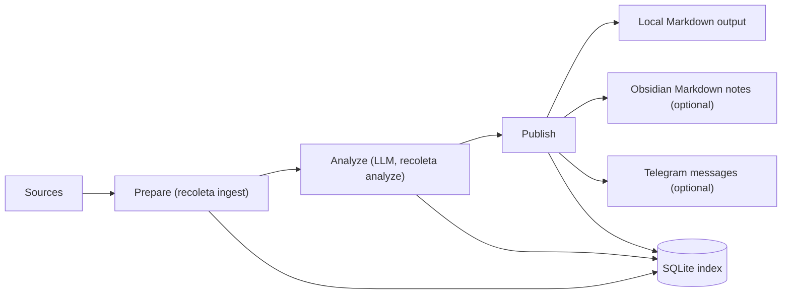

<p align="center">
  
</p>

<!-- Badges (replace with your links) -->
<!-- [](...) -->
<!-- [](...) -->
[](LICENSE)
[](#recoleta-installation)

Recoleta is a **research intelligence funnel** that ingests noisy sources, runs **structured LLM analysis**, and publishes high-signal outputs to **local Markdown by default** (with optional **Obsidian** and **Telegram** integrations) — so you can keep up with research without drowning in tabs.

## 📚 Contents

- [Overview](#recoleta-overview)
- [Features](#recoleta-features)
- [Installation](#recoleta-installation)
- [Docker / Compose](#recoleta-docker)
- [Usage](#recoleta-usage)
- [Configuration & CLI API](#recoleta-configuration)
- [Contributing](#recoleta-contributing)
- [License](#recoleta-license)

<a id="recoleta-overview"></a>
## 👀 Overview

Recoleta is local-first: it stores durable state in a local **SQLite** index and treats notes/messages as derived artifacts. A single instance can now run one or more **topic streams** so different topic domains can share ingest/enrich state while keeping analyze/publish outputs isolated.



<a id="recoleta-features"></a>
## ✨ Features

- **Multi-source ingestion**: arXiv, Hacker News RSS, Hugging Face Daily Papers, OpenReview, and custom RSS feeds.
- **Incremental & idempotent pipeline**: SQLite-backed state machine prevents duplicates and re-sends.
- **Structured LLM outputs**: JSON-only analysis validated by Pydantic (summary/tags/scores).
- **Topic streams**: one Recoleta instance can host multiple virtual topic-specific pipelines with separate analysis scopes and delivery sinks.
- **Semantic triage before LLM (optional)**: pre-rank (and optionally filter) candidates by topic similarity to improve LLM ROI under backlog.
- **Outputs where you read**: local Markdown output (default) + optional Obsidian notes + optional curated Telegram digest.
- **Trend surfaces**: trend markdown notes can be republished as browser-rendered PDFs and as a deployable static website.
- **Operationally friendly**: structured logs, per-run metrics in SQLite, optional scrubbed debug artifacts.

<a id="recoleta-installation"></a>
## 📦 Installation

### Prerequisites

- **Python**: >= 3.14
- **Package manager**: [`uv`](https://docs.astral.sh/uv/) (recommended)
- **LLM provider** supported by LiteLLM (e.g. OpenAI / Anthropic)
- **Pandoc** (recommended): used to generate `html_document_md` from arXiv `html_document` when available
- **Optional integrations**:
  - Obsidian Vault (for writing notes directly into Obsidian)
  - Telegram Bot token + destination chat ID (for mobile digest)
  - Chromium-compatible browser for browser-rendered trend PDFs (`uv run playwright install chromium` is a good fallback when no system browser is available)

### Install (from source)

```bash
git clone https://github.com/NeapolitanIcecream/recoleta.git
cd recoleta
uv sync
uv run recoleta --help
```

<a id="recoleta-docker"></a>
## 🐳 Docker / Compose

Recoleta now ships an official multi-target `Dockerfile`.

- `runtime`: core CLI image for `ingest`, `analyze`, `publish`, `run`, `gc`, `backup`, and `doctor`
- `runtime-full`: extends `runtime` with Pandoc and Chromium for richer trend PDF / browser-rendered surfaces

The Docker build uses `uv.lock` plus BuildKit cache mounts, so rebuilds should be materially faster after the first dependency sync when only application code changes.

The official container filesystem contract is:

- `/data/recoleta.db`
- `/data/outputs/`
- `/data/artifacts/`
- `/data/lancedb/`
- `/config/recoleta.yaml`

These are already wired through the image defaults:

```bash
RECOLETA_DB_PATH=/data/recoleta.db
MARKDOWN_OUTPUT_DIR=/data/outputs
ARTIFACTS_DIR=/data/artifacts
RAG_LANCEDB_DIR=/data/lancedb
RECOLETA_CONFIG_PATH=/config/recoleta.yaml
```

Build the core image:

```bash
docker build --target runtime -t recoleta:runtime .
```

Build the richer PDF/browser image:

```bash
docker build --target runtime-full -t recoleta:runtime-full .
```

`runtime-full` is intentionally much heavier because it installs Chromium. In practice, `runtime` is the better default for regular local/CI verification, while `runtime-full` fits release-time or explicitly manual builds.

Run a one-shot pipeline:

```bash
docker run --rm \
  --env-file .env \
  -v "$(pwd)/data:/data" \
  -v "$(pwd)/config:/config:ro" \
  recoleta:runtime run --once
```

Or use the included Compose example:

```bash
mkdir -p config data
cp recoleta.example.yaml config/recoleta.yaml
docker compose up -d
```

`.env` is optional for Compose itself, but is still the recommended place to provide LLM and delivery secrets.

The Compose service defaults to `recoleta run` and uses the read-only healthcheck:

```bash
recoleta doctor --healthcheck
```

For a read-only operational snapshot, use:

```bash
recoleta stats --json
```

If the container needs browser/PDF-capable trend surfaces, change the Compose build target from `runtime` to `runtime-full`.

<a id="recoleta-usage"></a>
## 🧰 Usage

### 🚀 Quick Start

Create a non-secret config file (all sources are disabled by default and must be explicitly enabled).

```bash
# Option A: copy the full example config and edit it
cp recoleta.example.yaml recoleta.yaml

# Option B: create a minimal config from scratch
cat <<'YAML' > recoleta.yaml
# NOTE: This file must NOT contain secrets. Keep tokens/API keys in env only.

recoleta_db_path: "~/.local/share/recoleta/recoleta.db"

# LiteLLM model naming: <provider>/<model-identifier>
# Examples:
# - openai/gpt-4o-mini
# - anthropic/claude-3-5-sonnet-20241022
llm_model: "openai/gpt-4o-mini"

# Publish targets (default: ["markdown"])
# Allowed: markdown, obsidian, telegram
publish_targets:
  - markdown

# Local Markdown output directory (default: platform-specific user data dir + /outputs)
markdown_output_dir: "~/.local/share/recoleta/outputs"

# Optional: language for summary text and trend notes.
# JSON keys stay in English and topics remain English tags.
llm_output_language: "Chinese (Simplified)"

topics:
  - agents
  - ml-systems

# Optional: instead of one global topic list, define multiple topic streams.
# topic_streams:
#   - name: agents_lab
#     topics: ["agents", "tooling"]
#     publish_targets: ["markdown", "telegram"]
#     telegram_bot_token_env: "AGENTS_LAB_TELEGRAM_BOT_TOKEN"
#     telegram_chat_id_env: "AGENTS_LAB_TELEGRAM_CHAT_ID"
#   - name: bio_watch
#     topics: ["biology", "therapeutics"]
#     publish_targets: ["markdown"]

sources:
  hn:
    enabled: true
    rss_urls:
      - "https://news.ycombinator.com/rss"
  rss:
    enabled: true
    feeds:
      - "https://example.com/feed.xml"

# Optional knobs
min_relevance_score: 0.6
max_deliveries_per_day: 10
write_debug_artifacts: false
YAML
```

Create a `.env` file for secrets and the config pointer.

```bash
cat <<'ENV' > .env
RECOLETA_CONFIG_PATH="./recoleta.yaml"

# LLM provider credentials (depends on your llm_model)
OPENAI_API_KEY="sk-replace-me"

# Optional: Telegram publishing (env-only)
# TELEGRAM_BOT_TOKEN="123456789:replace-me"
# TELEGRAM_CHAT_ID="@replace_me"
ENV
```

Run the pipeline end-to-end.

```bash
uv run recoleta ingest
uv run recoleta analyze --limit 50
uv run recoleta publish --limit 20
```

Or run the full pipeline once (no scheduler):

```bash
uv run recoleta run --once --analyze-limit 50 --publish-limit 20
```

Command intent:
- `recoleta ingest`: prepare backlog (ingest + enrich + optional semantic triage)
- `recoleta analyze`: Stage 4 only (LLM on prepared items)
- `recoleta publish`: deliver analyzed items
 - `recoleta run --once`: run `ingest -> analyze -> publish` once and exit

Where to look next:

- **Local Markdown**: `MARKDOWN_OUTPUT_DIR/latest.md` and `MARKDOWN_OUTPUT_DIR/Inbox/`
- **Topic streams**: when `topic_streams` is configured, Markdown output defaults to `MARKDOWN_OUTPUT_DIR/Streams/<stream>/`
- **Topic stream trends**: trend notes also follow stream-local output roots, e.g. `MARKDOWN_OUTPUT_DIR/Streams/<stream>/Trends/`
- **Obsidian notes (optional)**: `OBSIDIAN_VAULT_PATH/OBSIDIAN_BASE_FOLDER/Inbox/`
- **Telegram (optional)**: messages are sent to `TELEGRAM_CHAT_ID`
- **SQLite index**: `RECOLETA_DB_PATH` (safe to re-run; deliveries are idempotent)

### 📈 Trend analysis (daily / weekly / monthly)

Recoleta can generate **trend notes** as a standalone stage:

```bash
uv run recoleta trends
```

Key behaviors:

- **Time windows**: `--date` is an anchor date in **UTC** (`YYYY-MM-DD` or `YYYYMMDD`).
  - `day`: the UTC calendar day of `--date`
  - `week`: ISO week (Monday start) containing `--date`
  - `month`: calendar month containing `--date`
- **Corpus sources**:
  - `day` trends are generated from **analyzed items** in that day.
  - `week` trends are generated from existing **day trend documents** in that week.
  - `month` trends are generated from existing **week trend documents** in that month.
- **Optional auto-backfill**: `--backfill` can auto-generate missing lower-granularity trends before generating `week`/`month` trends.
  - `week --backfill`: generates missing `day` trends for the week first.
  - `month --backfill`: (not yet) generates missing `week` trends for the month first.
- **Token-safe**: if the corpus is empty, Recoleta **skips the LLM call** and emits a placeholder trend document.

Examples:

```bash
# Daily trend for today (UTC)
uv run recoleta trends --granularity day

# Daily trend for a specific day (UTC)
uv run recoleta trends --granularity day --date 2026-03-02

# Weekly trend (by default, requires daily trends for that week)
uv run recoleta trends --granularity week --date 2026-03-02

# Weekly trend with automatic daily backfill (missing days only)
uv run recoleta trends --granularity week --date 2026-03-02 --backfill

# Shortcut: weekly trend + backfill
uv run recoleta trends-week --date 2026-03-02

# Rebuild all daily trends for the week, then generate the weekly trend
uv run recoleta trends-week --date 2026-03-02 --backfill-mode all

# Monthly trend (requires weekly trends for that month)
uv run recoleta trends --granularity month --date 2026-03-02

# Override the LLM model used for trend generation
uv run recoleta trends --granularity week --model "openai/gpt-4o-mini"
```

Outputs:

- **SQLite**: a durable `trend` document is persisted into `RECOLETA_DB_PATH`.
- **Local Markdown** (when `PUBLISH_TARGETS` includes `markdown`): `MARKDOWN_OUTPUT_DIR/Trends/` (canonical source for downstream PDF/site rendering)
- **Obsidian** (when `PUBLISH_TARGETS` includes `obsidian`): `OBSIDIAN_VAULT_PATH/OBSIDIAN_BASE_FOLDER/Trends/`
- **Telegram PDF** (when `PUBLISH_TARGETS` includes `telegram` and the corpus is non-empty): `<trend-note>.pdf`, rendered from the canonical markdown note

When `topic_streams` is configured, `recoleta trends` and `recoleta trends-week` run once per stream. Their outputs move under each stream root instead:

- Markdown: `MARKDOWN_OUTPUT_DIR/Streams/<stream>/Trends/`
- Obsidian: `OBSIDIAN_BASE_FOLDER/Streams/<stream>/Trends/`
- CLI summary: one aggregate line plus one `stream -> doc_id` line per stream

Optional knobs (env or config):

- `RAG_LANCEDB_DIR`: where semantic vectors are stored (default: platform user data dir + `/lancedb`)
- `TRENDS_EMBEDDING_MODEL`, `TRENDS_EMBEDDING_DIMENSIONS`
- `TRENDS_EMBEDDING_FAILURE_MODE` (`continue|fail_fast|threshold`) and `TRENDS_EMBEDDING_MAX_ERRORS` (required when `threshold`)

PDF behavior:

- Telegram trend delivery renders the PDF from the canonical markdown note under `MARKDOWN_OUTPUT_DIR/Trends/`, or `MARKDOWN_OUTPUT_DIR/Streams/<stream>/Trends/` in topic-stream mode.
- The renderer uses `backend="auto"`: browser rendering via Playwright/Chromium first, then a `PyMuPDF Story` fallback if browser rendering is unavailable.
- Telegram uses a browser-rendered `continuous` page mode by default to avoid A4 page breaks in the mobile reading surface.
- `uv run recoleta trends --granularity day --debug-pdf` writes a debug bundle to `MARKDOWN_OUTPUT_DIR/Trends/.pdf-debug/<pdf-stem>/` containing the source markdown, normalized markdown, HTML, CSS, manifest, and per-page PNG previews.

### 🌐 Static trends site

Recoleta can turn trend notes into a deployable static website:

```bash
# Build a local preview from trend markdown notes
uv run recoleta site build

# Stage trend markdown/PDF artifacts into the repo for deployment
uv run recoleta site stage
```

Behavior:

- `recoleta site build` writes a clean static site to `MARKDOWN_OUTPUT_DIR/site` by default.
- `recoleta site stage` mirrors trend markdown notes into `./site-content/Trends` by default, or `./site-content/Streams/<stream>/Trends/` in topic-stream mode.
- In topic-stream mode, both commands automatically aggregate every `MARKDOWN_OUTPUT_DIR/Streams/<stream>/Trends/` directory.
- The static site now exposes a `Streams` navigation surface so mixed-domain trend notes are not silently flattened together.
- Both commands treat the output directory as a managed artifact and clear stale files before writing.

For CI or GitHub Pages, you can pass explicit directories and avoid depending on a full Recoleta config:

```bash
uv run recoleta site build \
  --input-dir site-content \
  --output-dir site-dist
```

GitHub Pages flow:

1. Run `uv run recoleta site stage` after generating new trend notes.
2. Commit `site-content/` to the repo.
3. In the GitHub repository settings, set **Pages** to **GitHub Actions**.
4. Push to `main`.

The included workflow `.github/workflows/site-pages.yml` builds `site-dist/` from `site-content/` and deploys it to Pages.

### 🗓️ Run continuously (built-in scheduler)

```bash
uv run recoleta run
```

Tune the intervals via:

- `INGEST_INTERVAL_MINUTES`
- `ANALYZE_INTERVAL_MINUTES`
- `PUBLISH_INTERVAL_MINUTES`

### 🧪 Run manually (cron / launchd / systemd-friendly)

```bash
uv run recoleta run --once
```

Use explicit stage commands only when you intentionally want per-stage control:

```bash
uv run recoleta ingest
uv run recoleta analyze
uv run recoleta publish
```

Read-only operator checks:

```bash
# healthcheck-style contract; add freshness gating when needed
uv run recoleta doctor --healthcheck --max-success-age-minutes 180

# machine-readable backlog / lease / size snapshot
uv run recoleta stats --json
```

### 🧱 Deployment recipes

Recommended deployment split:

- use `uv run recoleta run` for a local always-on process
- use `uv run recoleta run --once` for cron, launchd, systemd timers, and scheduled containers
- use `uv run recoleta doctor --healthcheck` for supervisor/container liveness checks
- use `uv run recoleta stats --json` for dashboards, ad hoc inspections, or periodic snapshots

Minimal cron example:

```bash
*/15 * * * * cd /path/to/recoleta && /path/to/uv run recoleta run --once >> /var/log/recoleta.log 2>&1
```

Minimal systemd pattern:

```ini
# /etc/systemd/system/recoleta.service
[Unit]
Description=Recoleta one-shot pipeline
After=network-online.target

[Service]
Type=oneshot
WorkingDirectory=/path/to/recoleta
Environment=RECOLETA_CONFIG_PATH=/path/to/recoleta.yaml
ExecStart=/path/to/uv run recoleta run --once
```

```ini
# /etc/systemd/system/recoleta.timer
[Unit]
Description=Run Recoleta every 15 minutes

[Timer]
OnBootSec=5m
OnUnitActiveSec=15m
Unit=recoleta.service

[Install]
WantedBy=timers.target
```

### 🧹 Maintenance and recovery

Routine maintenance commands:

```bash
# prune expired debug artifacts, old runs, and old metrics
uv run recoleta gc

# additionally prune rebuildable caches such as inactive vector tables and derived PDFs
uv run recoleta gc --prune-caches

# compact the SQLite file after large cleanup windows
uv run recoleta vacuum
```

DB-scoped backup and restore:

```bash
# create a timestamped bundle under <db-dir>/backups/ by default
uv run recoleta backup

# restore from a specific bundle; requires explicit confirmation
uv run recoleta restore --bundle /path/to/backup-bundle --yes
```

Scope notes:

- `backup` / `restore` operate on the SQLite state store only
- markdown outputs, artifacts, and LanceDB directories should still be protected by normal filesystem backups when they matter
- default GC is conservative; cache pruning is explicit so old canonical notes are not deleted by surprise

<a id="recoleta-configuration"></a>
## ⚙️ Configuration & CLI API

### Configuration sources & precedence

Recoleta loads typed settings from:

1. **Init args** (rare; mainly for tests)
2. **Environment variables**
3. **`.env`** in the working directory
4. **Config file** pointed to by `RECOLETA_CONFIG_PATH` (`.yaml`/`.yml`/`.json`)
5. Defaults (for optional fields)

**Secrets rule**: `TELEGRAM_BOT_TOKEN` and `TELEGRAM_CHAT_ID` are forbidden in the config file and must come from environment variables only.

### Settings reference

Required:

- `RECOLETA_DB_PATH` / `recoleta_db_path` (SQLite file path)
- `LLM_MODEL` / `llm_model` (LiteLLM model, format: `<provider>/<model>`)
- `PUBLISH_TARGETS` / `publish_targets` (default: `["markdown"]`)
- `MARKDOWN_OUTPUT_DIR` / `markdown_output_dir` (default: platform-specific data dir + `/outputs`)

Conditionally required:

- `OBSIDIAN_VAULT_PATH` / `obsidian_vault_path` (required when `PUBLISH_TARGETS` includes `obsidian`)
- `TELEGRAM_BOT_TOKEN` (env-only, required when `PUBLISH_TARGETS` includes `telegram`)
- `TELEGRAM_CHAT_ID` (env-only, required when `PUBLISH_TARGETS` includes `telegram`)

Common optional knobs:

- **LLM output language**:
  - `LLM_OUTPUT_LANGUAGE` / `llm_output_language` (applies to `summary` and trend notes; JSON keys and `topics` stay English)
- **Sources**: `SOURCES` / `sources`
  - `hn.enabled`, `hn.rss_urls`
  - `rss.enabled`, `rss.feeds`
  - `arxiv.enabled`, `arxiv.queries`, `arxiv.max_results_per_run`
  - `arxiv.enrich_method`, `arxiv.enrich_failure_mode`
  - `arxiv.html_document_max_concurrency`, `arxiv.html_document_requests_per_second`
  - `arxiv.html_document_log_sample_rate`
  - `openreview.enabled`, `openreview.venues`
  - `hf_daily.enabled`
- **Relevance & filtering**:
  - `TOPICS` / `topics`
  - `ALLOW_TAGS` / `allow_tags`
  - `DENY_TAGS` / `deny_tags`
  - `MIN_RELEVANCE_SCORE` / `min_relevance_score`
  - `MAX_DELIVERIES_PER_DAY` / `max_deliveries_per_day`
- **Analysis content truncation**:
  - `ANALYZE_CONTENT_MAX_CHARS` / `analyze_content_max_chars` (default: `32768`, set to `0` to disable truncation)
- **Semantic triage (pre-ranking before LLM)** (runs only when `TRIAGE_ENABLED=true` and `TOPICS` is non-empty):
  - `TRIAGE_ENABLED` / `triage_enabled`
  - `TRIAGE_MODE` / `triage_mode` (`prioritize|filter`)
  - `TRIAGE_EMBEDDING_MODEL` / `triage_embedding_model`
  - `TRIAGE_EMBEDDING_DIMENSIONS` / `triage_embedding_dimensions`
  - `TRIAGE_EMBEDDING_BATCH_MAX_INPUTS` / `triage_embedding_batch_max_inputs`
  - `TRIAGE_EMBEDDING_BATCH_MAX_CHARS` / `triage_embedding_batch_max_chars`
  - `TRIAGE_QUERY_MODE` / `triage_query_mode` (`joined|max_per_topic`)
  - `TRIAGE_CANDIDATE_FACTOR` / `triage_candidate_factor`
  - `TRIAGE_MAX_CANDIDATES` / `triage_max_candidates`
  - `TRIAGE_ITEM_TEXT_MAX_CHARS` / `triage_item_text_max_chars`
  - `TRIAGE_MIN_SIMILARITY` / `triage_min_similarity` (filter mode only)
  - `TRIAGE_EXPLORATION_RATE` / `triage_exploration_rate`
  - `TRIAGE_RECENCY_FLOOR` / `triage_recency_floor`
- **Execution limits**:
  - `ANALYZE_LIMIT` / `analyze_limit` (default Stage 4 batch size; also used as Stage 3.5 selection limit)
- **Dedup**:
  - `TITLE_DEDUP_THRESHOLD` / `title_dedup_threshold`
  - `TITLE_DEDUP_MAX_CANDIDATES` / `title_dedup_max_candidates`
- **Outputs**:
  - `PUBLISH_TARGETS` / `publish_targets`
  - `MARKDOWN_OUTPUT_DIR` / `markdown_output_dir`
  - `OBSIDIAN_BASE_FOLDER` / `obsidian_base_folder`
  - `ARTIFACTS_DIR` / `artifacts_dir` (required if `WRITE_DEBUG_ARTIFACTS=true`)
- **Browser PDF rendering**:
  - `RECOLETA_PLAYWRIGHT_EXECUTABLE_PATH`
  - `PLAYWRIGHT_CHROMIUM_EXECUTABLE_PATH`
  - `GOOGLE_CHROME_BIN`
  - `CHROME_BIN`
- **Scheduling**:
  - `INGEST_INTERVAL_MINUTES`, `ANALYZE_INTERVAL_MINUTES`, `PUBLISH_INTERVAL_MINUTES`
- **Logging & diagnostics**:
  - `LOG_LEVEL` / `log_level`
  - `LOG_JSON` / `log_json`
  - `WRITE_DEBUG_ARTIFACTS` / `write_debug_artifacts`

### LiteLLM provider credentials

Recoleta delegates LLM calls to LiteLLM. You must provide provider credentials via environment variables. Common examples:

- OpenAI: `OPENAI_API_KEY`
- Anthropic: `ANTHROPIC_API_KEY`
- OpenRouter: `OPENROUTER_API_KEY`
- Custom OpenAI-compatible endpoints (including LiteLLM Proxy): set `OPENAI_API_BASE` (or `OPENAI_BASE_URL`) to the endpoint base URL.
- Custom OpenRouter endpoints: set `OPENROUTER_API_BASE` (or `OPENROUTER_BASE_URL`) to the endpoint base URL.

### Debug artifacts & metrics (optional)

Enable scrubbed debug artifacts:

- Set `WRITE_DEBUG_ARTIFACTS=true`
- Set `ARTIFACTS_DIR=/absolute/path/to/artifacts`

Recoleta writes per-run/per-item JSON artifacts (e.g. failure context and LLM request/response payloads) and **scrubs known secrets** before persisting them.

Recoleta also records lightweight, machine-readable **metrics** into the SQLite `metrics` table (e.g. stage durations, LLM call counts, publish outcomes).

### CLI commands

Recoleta ships a small CLI surface:

- `recoleta ingest`: prepare items for LLM (ingest + enrich + optional triage)
- `recoleta analyze --limit 100`: run structured LLM analysis for prepared items only
- `recoleta publish --limit 50`: write Markdown/Obsidian notes and send Telegram deliverables
- `recoleta run`: schedule ingest/analyze/publish periodically
- `recoleta trends --granularity week --date 2026-03-02`: generate a trend note (day/week/month)
- `recoleta trends --granularity day --debug-pdf`: generate a trend note and export a PDF debug bundle for the rendered Telegram PDF
- `recoleta site build`: render a static site from trend markdown notes
- `recoleta site stage`: mirror trend markdown/PDF artifacts into `site-content/` while preserving topic-stream layout

### Further reading

- [`docs/design/system-overview.md`](docs/design/system-overview.md) — goals, non-goals, and the end-to-end workflow
- [`docs/design/architecture.md`](docs/design/architecture.md) — module boundaries, pipeline stages, storage, and observability
- [`docs/design/configuration.md`](docs/design/configuration.md) — full configuration reference and rules
- [`docs/design/semantic-pre-ranking.md`](docs/design/semantic-pre-ranking.md) — semantic triage before LLM (pre-ranking and optional filtering)
- [`docs/design/outputs.md`](docs/design/outputs.md) — publish targets and local Markdown layout
- [`docs/design/trend-surfaces.md`](docs/design/trend-surfaces.md) — canonical trend markdown, browser PDF rendering, debug bundles, and static site deployment
- [`docs/design/llm-output-language.md`](docs/design/llm-output-language.md) — configurable analysis language behavior
- [`docs/design/data-model.md`](docs/design/data-model.md) — SQLite schema and Obsidian note layout
- [`docs/adr/`](docs/adr/) — architecture decision records (SQLite, LiteLLM, config file, Telegram delivery)

<a id="recoleta-contributing"></a>
## 🤝 Contributing

Install dev dependencies and run checks:

```bash
uv sync --dev
uv run pytest
uv run ruff check .
```

<a id="recoleta-license"></a>
## 📄 License

Licensed under the **Apache License 2.0**. See [`LICENSE`](LICENSE).
