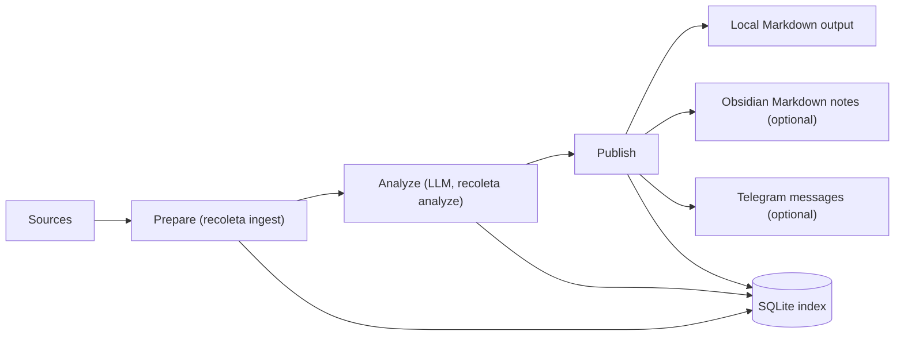

<p align="center">
  
</p>

[](https://github.com/NeapolitanIcecream/recoleta/actions/workflows/ci.yml)
[](https://neapolitanicecream.github.io/recoleta/)
[](LICENSE)
[](#recoleta-installation)

Recoleta is a **local-first AI research radar** for **arXiv, Hacker News, OpenReview, Hugging Face Daily Papers, and RSS**. It turns noisy source streams into **trend briefs**, **idea briefs**, and a **public research site**, then projects the same results to **local Markdown first** with optional **Obsidian** and **Telegram** delivery.

**Start here:** [Live demo](https://neapolitanicecream.github.io/recoleta/) · [5-minute quickstart](#recoleta-quickstart) · [First output tour](./docs/guides/first-output-tour.md) · [Preset gallery](./presets/README.md)

- Track one topic list or multiple topic streams from the same local workspace.
- Publish daily trend briefs, evidence-grounded idea briefs, PDFs, and a public site from one pipeline.
- Keep durable state in SQLite and treat Markdown, Obsidian, Telegram, and site output as derived artifacts.

## 📚 Contents

- [Overview](#recoleta-overview)
- [Features](#recoleta-features)
- [Installation](#recoleta-installation)
- [Docker / Compose](#recoleta-docker)
- [Usage](#recoleta-usage)
- [Starter presets](#recoleta-presets)
- [Common commands](#recoleta-common-commands)
- [Guides & reference](#recoleta-guides)
- [Contributing](#recoleta-contributing)
- [License](#recoleta-license)

<a id="recoleta-overview"></a>
## 👀 Overview

Recoleta is local-first by design: it stores durable state in a local **SQLite** index and treats notes, PDFs, and site pages as derived artifacts. A single instance can run one or more **topic streams**, so different research domains can share ingest/enrich state while keeping analyze/publish outputs isolated.



<a id="recoleta-features"></a>
## ✨ Features

- **Multi-source, stateful ingestion**: arXiv, Hacker News RSS, Hugging Face Daily Papers, OpenReview, and custom RSS feeds, with saved pull state for incremental runs.
- **Incremental & idempotent pipeline**: SQLite-backed state machine prevents duplicates and re-sends.
- **Structured LLM outputs**: JSON-only analysis validated by Pydantic (summary/tags/scores).
- **Topic streams**: one Recoleta instance can host multiple virtual topic-specific pipelines with separate analysis scopes and delivery sinks.
- **Semantic triage before LLM (optional)**: pre-rank (and optionally filter) candidates by topic similarity to improve LLM ROI under backlog.
- **Outputs where you read**: local Markdown output (default) + optional Obsidian notes + optional curated Telegram digest.
- **Trend surfaces with retrieval context**: trend generation can enrich prompts with semantic overview packs, representative source docs, bounded peer-history windows, browser-rendered PDFs, and a deployable static website.
- **Follow-on opportunity mining**: `recoleta ideas` can derive evidence-grounded why-now ideas from existing trend synthesis outputs without rerunning the full trend agent.
- **Operationally friendly**: structured logs, per-run metrics in SQLite, optional scrubbed debug artifacts.

<a id="recoleta-installation"></a>
## 📦 Installation

### Prerequisites

- **Python**: >= 3.14
- **Package manager**: [`uv`](https://docs.astral.sh/uv/) (recommended)
- **LLM provider** supported by LiteLLM (e.g. OpenAI / Anthropic)
- **Pandoc** (recommended): used to generate `html_document_md` from arXiv `html_document` when available
- **Optional integrations**:
  - Obsidian Vault (for writing notes directly into Obsidian)
  - Telegram Bot token + destination chat ID (for mobile digest)
  - Chromium-compatible browser for browser-rendered trend PDFs (`uv run playwright install chromium` is a good fallback when no system browser is available)

### Install (from source)

```bash
git clone https://github.com/NeapolitanIcecream/recoleta.git
cd recoleta
uv sync
uv run recoleta --help
```

<a id="recoleta-docker"></a>
## 🐳 Docker / Compose

Recoleta now ships an official multi-target `Dockerfile`.

- `runtime`: the default CLI image for the full command surface, including ingest/analyze/publish/run plus trends, site, RAG, DB, and maintenance commands
- `runtime-full`: extends `runtime` with Pandoc and Chromium for `html_document_md`, browser-rendered trend PDFs, and richer trend/web publishing flows

The Docker build uses `uv.lock` plus BuildKit cache mounts, so rebuilds should be materially faster after the first dependency sync when only application code changes.

The official container filesystem contract is:

- `/data/recoleta.db`
- `/data/outputs/`
- `/data/artifacts/`
- `/data/lancedb/`
- `/config/recoleta.yaml`

These are already wired through the image defaults:

```bash
RECOLETA_DB_PATH=/data/recoleta.db
MARKDOWN_OUTPUT_DIR=/data/outputs
ARTIFACTS_DIR=/data/artifacts
RAG_LANCEDB_DIR=/data/lancedb
RECOLETA_CONFIG_PATH=/config/recoleta.yaml
```

Build the core image:

```bash
docker build --target runtime -t recoleta:runtime .
```

Build the richer PDF/browser image:

```bash
docker build --target runtime-full -t recoleta:runtime-full .
```

`runtime-full` is intentionally much heavier because it installs Chromium. In practice, `runtime` is the better default for regular local/CI verification, while `runtime-full` fits release-time or explicitly manual builds.

Run a one-shot pipeline:

```bash
docker run --rm \
  --env-file .env \
  -v "$(pwd)/data:/data" \
  -v "$(pwd)/config:/config:ro" \
  recoleta:runtime run --once
```

Or use the included Compose example:

```bash
mkdir -p config data
cp recoleta.example.yaml config/recoleta.yaml
docker compose up -d
```

`.env` is optional for Compose itself, but is still the recommended place to provide LLM and delivery secrets.

The Compose service defaults to `recoleta run` and uses the read-only healthcheck:

```bash
recoleta doctor --healthcheck
```

For a read-only operational snapshot, use:

```bash
recoleta stats --json
```

If the container needs browser/PDF-capable trend surfaces, change the Compose build target from `runtime` to `runtime-full`.

<a id="recoleta-usage"></a>
## 🧰 Usage

<a id="recoleta-quickstart"></a>
### 🚀 Quick Start

#### 5-minute local run (Docker Compose)

Use the bundled `docker-compose.yml` when you want the shortest path from repo clone to first local output:

```bash
mkdir -p config data
cp recoleta.example.yaml config/recoleta.yaml

cat <<'ENV' > .env
RECOLETA_CONFIG_PATH=/config/recoleta.yaml
RECOLETA_LLM_API_KEY="sk-replace-me"
ENV

docker compose run --rm recoleta run --once --analyze-limit 50 --publish-limit 20
```

First places to check after that run:

- `./data/outputs/latest.md`
- `./data/outputs/Inbox/`
- `./data/recoleta.db`

If you want to see what those outputs should grow into next, use the
[first output tour](./docs/guides/first-output-tour.md).

#### Developer/source workflow

Create a non-secret config file (all sources are disabled by default and must be explicitly enabled).

```bash
# Option A: copy the full example config and edit it
cp recoleta.example.yaml recoleta.yaml

# Option B: create a minimal config from scratch
cat <<'YAML' > recoleta.yaml
# NOTE: This file must NOT contain secrets. Keep tokens/API keys in env only.

recoleta_db_path: "~/.local/share/recoleta/recoleta.db"

# LiteLLM model naming: <provider>/<model-identifier>
# Examples:
# - openai/gpt-5.4
# - anthropic/claude-3-5-sonnet-20241022
llm_model: "openai/gpt-5.4"

# Publish targets (default: ["markdown"])
# Allowed: markdown, obsidian, telegram
publish_targets:
  - markdown

# Local Markdown output directory (default: platform-specific user data dir + /outputs)
markdown_output_dir: "~/.local/share/recoleta/outputs"

# Optional: language for summary text and trend notes.
# JSON keys stay in English and topics remain English tags.
llm_output_language: "Chinese (Simplified)"

topics:
  - agents
  - ml-systems

# Optional: instead of one global topic list, define multiple topic streams.
# topic_streams:
#   - name: agents_lab
#     topics: ["agents", "tooling"]
#     publish_targets: ["markdown", "telegram"]
#     telegram_bot_token_env: "AGENTS_LAB_TELEGRAM_BOT_TOKEN"
#     telegram_chat_id_env: "AGENTS_LAB_TELEGRAM_CHAT_ID"
#   - name: bio_watch
#     topics: ["biology", "therapeutics"]
#     publish_targets: ["markdown"]

sources:
  hn:
    enabled: true
    rss_urls:
      - "https://news.ycombinator.com/rss"
  rss:
    enabled: true
    feeds:
      - "https://example.com/feed.xml"

# Optional knobs
min_relevance_score: 0.6
max_deliveries_per_day: 10
write_debug_artifacts: false
YAML
```

Create a `.env` file for secrets and the config pointer.

```bash
cat <<'ENV' > .env
RECOLETA_CONFIG_PATH="./recoleta.yaml"

# Preferred: Recoleta-scoped LLM connection overrides
RECOLETA_LLM_API_KEY="sk-replace-me"
# RECOLETA_LLM_BASE_URL="http://localhost:4000/v1"

# Backward-compatible provider credentials (still supported)
# OPENAI_API_KEY="sk-replace-me"

# Optional: Telegram publishing (env-only)
# TELEGRAM_BOT_TOKEN="123456789:replace-me"
# TELEGRAM_CHAT_ID="@replace_me"
ENV
```

Run the pipeline end-to-end.

```bash
uv run recoleta ingest
uv run recoleta analyze --limit 50
uv run recoleta publish --limit 20
```

Or run the full pipeline once (no scheduler):

```bash
uv run recoleta run --once --analyze-limit 50 --publish-limit 20
```

For targeted catch-up or replay of one UTC day, pass `--date` to the stage command or the one-shot pipeline:

```bash
uv run recoleta ingest --date 2026-01-02
uv run recoleta analyze --date 2026-01-02 --limit 50
uv run recoleta publish --date 2026-01-02 --limit 20
uv run recoleta run --once --date 2026-01-02 --analyze-limit 50 --publish-limit 20
```

Command intent:
- `recoleta ingest`: prepare backlog (ingest + enrich + optional semantic triage)
- `recoleta analyze`: Stage 4 only (LLM on prepared items)
- `recoleta publish`: deliver analyzed items
- `recoleta run --once`: run `ingest -> analyze -> publish` once and exit

Incremental pull behavior:

- `--date` scopes `ingest`, `analyze`, `publish`, and `run --once` to one UTC day.
- When `--date` is omitted, source connectors reuse persisted pull state such as watermarks and conditional fetch headers where supported.
- Source-level diagnostics are recorded in SQLite metrics, including counts like `filtered_out_total`, `in_window_total`, and `not_modified_total`.

Where to look next:

- **Local Markdown**: `MARKDOWN_OUTPUT_DIR/latest.md` and `MARKDOWN_OUTPUT_DIR/Inbox/`
- **Topic streams**: when `topic_streams` is configured, Markdown output defaults to `MARKDOWN_OUTPUT_DIR/Streams/<stream>/`
- **Topic stream trends**: trend notes also follow stream-local output roots, e.g. `MARKDOWN_OUTPUT_DIR/Streams/<stream>/Trends/`
- **Ideas briefs**: opportunity notes write to `MARKDOWN_OUTPUT_DIR/Ideas/`, or `MARKDOWN_OUTPUT_DIR/Streams/<stream>/Ideas/` in topic-stream mode
- **Obsidian notes (optional)**: `OBSIDIAN_VAULT_PATH/OBSIDIAN_BASE_FOLDER/Inbox/`
- **Telegram (optional)**: messages are sent to `TELEGRAM_CHAT_ID`
- **SQLite index**: `RECOLETA_DB_PATH` (safe to re-run; deliveries are idempotent)

<a id="recoleta-presets"></a>
### 🧭 Starter presets

Use a ready-made preset when you want a narrower starting point than the full
example config:

- [`presets/agents-radar.yaml`](./presets/agents-radar.yaml): AI builders, code agents, tool use, and eval tracking
- [`presets/robotics-radar.yaml`](./presets/robotics-radar.yaml): embodied AI, VLA, and robotics watching
- [`presets/arxiv-digest.yaml`](./presets/arxiv-digest.yaml): paper-first arXiv monitoring with minimal source noise
- [`presets/README.md`](./presets/README.md): quick guidance on which preset to start from
- [`docs/guides/first-output-tour.md`](./docs/guides/first-output-tour.md): sample outputs, screenshots, and preset-to-demo mapping

<a id="recoleta-common-commands"></a>
### 🧰 Common commands

```bash
# run the full pipeline once
uv run recoleta run --once --analyze-limit 50 --publish-limit 20

# generate a daily or weekly trend brief
uv run recoleta trends --granularity day
uv run recoleta trends-week --date 2026-03-02

# derive idea briefs from an existing trend window
uv run recoleta ideas --granularity day --date 2026-03-09

# build or preview the public site
uv run recoleta site build
uv run recoleta site serve

# operator checks
uv run recoleta doctor --healthcheck --max-success-age-minutes 180
uv run recoleta stats --json
```

Use the full recipes guide for trend backfills, `ideas`, site deploy, cron,
systemd, maintenance, and recovery workflows:

- [`docs/guides/usage-recipes.md`](docs/guides/usage-recipes.md)

<a id="recoleta-guides"></a>
## 📚 Guides & reference

- [`docs/guides/usage-recipes.md`](docs/guides/usage-recipes.md) — CLI recipes, trend/ideas/site workflows, ops, and maintenance
- [`docs/guides/first-output-tour.md`](docs/guides/first-output-tour.md) — what a successful first run creates, with sample screenshots and preset mapping
- [`docs/releases/github-launch-handoff.md`](docs/releases/github-launch-handoff.md) — About text, topics, social preview, Discussions, and release handoff
- [`docs/releases/v0.1.0-draft.md`](docs/releases/v0.1.0-draft.md) — draft release notes for the first public baseline
- [`docs/releases/v0.1.0-launch-kit.md`](docs/releases/v0.1.0-launch-kit.md) — ready-to-use release copy, launch post drafts, and proof points
- [`docs/design/system-overview.md`](docs/design/system-overview.md) — goals, non-goals, and the end-to-end workflow
- [`docs/design/configuration.md`](docs/design/configuration.md) — full configuration reference and rules
- [`docs/design/outputs.md`](docs/design/outputs.md) — publish targets and filesystem/layout contracts
- [`docs/design/trend-surfaces.md`](docs/design/trend-surfaces.md) — trend markdown, PDFs, and static site behavior
- [`docs/design/architecture.md`](docs/design/architecture.md) — module boundaries, pipeline stages, storage, and observability
- [`docs/design/data-model.md`](docs/design/data-model.md) — SQLite schema and output layout
- [`docs/design/semantic-pre-ranking.md`](docs/design/semantic-pre-ranking.md) — semantic triage before LLM
- [`docs/design/llm-output-language.md`](docs/design/llm-output-language.md) — configurable analysis language behavior
- [`docs/plans/2026-03-14-ideas-real-data-smoke-and-calibration.md`](docs/plans/2026-03-14-ideas-real-data-smoke-and-calibration.md) — current `ideas` prompt baseline and audit
- [`docs/adr/`](docs/adr/) — architecture decision records

<a id="recoleta-contributing"></a>
## 🤝 Contributing

See [`CONTRIBUTING.md`](./CONTRIBUTING.md) for contribution guidelines, issue
templates, and PR expectations.

Install dev dependencies and run checks:

```bash
uv sync --group dev
uv run pytest
uv run ruff check .
```

<a id="recoleta-license"></a>
## 📄 License

Licensed under the **Apache License 2.0**. See [`LICENSE`](LICENSE).
