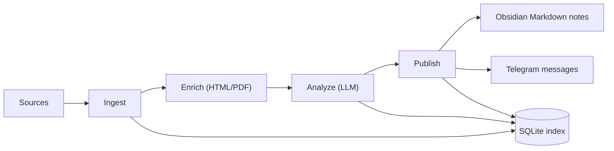

# Recoleta

<!-- Badges (replace with your links) -->
<!-- [](...) -->
<!-- [](...) -->
[](LICENSE)
[](#recoleta-installation)

Recoleta is a **research intelligence funnel** that ingests noisy sources, runs **structured LLM analysis**, and publishes high-signal outputs to **Obsidian** and **Telegram** — so you can keep up with research without drowning in tabs.

## 📚 Contents

- [Overview](#recoleta-overview)
- [Features](#recoleta-features)
- [Installation](#recoleta-installation)
- [Usage](#recoleta-usage)
- [Configuration & CLI API](#recoleta-configuration)
- [Contributing](#recoleta-contributing)
- [License](#recoleta-license)

<a id="recoleta-overview"></a>
## 👀 Overview

Recoleta is local-first and single-user by design: it stores durable state in a local **SQLite** index and treats notes/messages as derived artifacts.



<a id="recoleta-features"></a>
## ✨ Features

- **Multi-source ingestion**: arXiv, Hacker News RSS, Hugging Face Daily Papers, OpenReview, and custom RSS feeds.
- **Incremental & idempotent pipeline**: SQLite-backed state machine prevents duplicates and re-sends.
- **Structured LLM outputs**: JSON-only analysis validated by Pydantic (summary/insight/ideas/tags/scores).
- **Outputs where you read**: Obsidian notes (with YAML frontmatter) + a small curated Telegram digest.
- **Operationally friendly**: structured logs, per-run metrics in SQLite, optional scrubbed debug artifacts.

<a id="recoleta-installation"></a>
## 📦 Installation

### Prerequisites

- **Python**: >= 3.14
- **Package manager**: [`uv`](https://docs.astral.sh/uv/) (recommended)
- **Integrations**:
  - An Obsidian Vault on your machine
  - A Telegram bot token + destination chat ID
  - An LLM provider supported by LiteLLM (e.g. OpenAI / Anthropic)

### Install (from source)

```bash
git clone https://github.com/NeapolitanIcecream/recoleta.git
cd recoleta
uv sync
uv run recoleta --help
```

<a id="recoleta-usage"></a>
## 🧰 Usage

### 🚀 Quick Start

Create a non-secret config file.

```bash
cat <<'YAML' > recoleta.yaml
# NOTE: This file must NOT contain secrets. Keep tokens/API keys in env only.

obsidian_vault_path: "/ABS/PATH/TO/YOUR/Obsidian Vault"
recoleta_db_path: "~/.local/share/recoleta/recoleta.db"

# LiteLLM model naming: <provider>/<model-identifier>
# Examples:
# - openai/gpt-4o-mini
# - anthropic/claude-3-5-sonnet-20241022
llm_model: "openai/gpt-4o-mini"

topics:
  - agents
  - ml-systems

sources:
  hn:
    rss_urls:
      - "https://news.ycombinator.com/rss"
  rss:
    feeds:
      - "https://example.com/feed.xml"

# Optional knobs
min_relevance_score: 0.6
max_deliveries_per_day: 10
obsidian_base_folder: "Recoleta"
write_debug_artifacts: false
YAML
```

Create a `.env` file for secrets and the config pointer.

```bash
cat <<'ENV' > .env
RECOLETA_CONFIG_PATH="./recoleta.yaml"

# Required secrets (env-only)
TELEGRAM_BOT_TOKEN="123456789:replace-me"
TELEGRAM_CHAT_ID="@replace_me"

# LLM provider credentials (depends on your llm_model)
OPENAI_API_KEY="sk-replace-me"
ENV
```

Run the pipeline end-to-end.

```bash
uv run recoleta ingest
uv run recoleta analyze --limit 50
uv run recoleta publish --limit 20
```

Where to look next:

- **Obsidian notes**: `OBSIDIAN_VAULT_PATH/OBSIDIAN_BASE_FOLDER/Inbox/`
- **Telegram**: messages are sent to `TELEGRAM_CHAT_ID`
- **SQLite index**: `RECOLETA_DB_PATH` (safe to re-run; deliveries are idempotent)

### 🗓️ Run continuously (built-in scheduler)

```bash
uv run recoleta run
```

Tune the intervals via:

- `INGEST_INTERVAL_MINUTES`
- `ANALYZE_INTERVAL_MINUTES`
- `PUBLISH_INTERVAL_MINUTES`

### 🧪 Run manually (cron/launchd-friendly)

```bash
uv run recoleta ingest && uv run recoleta analyze && uv run recoleta publish
```

<a id="recoleta-configuration"></a>
## ⚙️ Configuration & CLI API

### Configuration sources & precedence

Recoleta loads typed settings from:

1. **Init args** (rare; mainly for tests)
2. **Environment variables**
3. **`.env`** in the working directory
4. **Config file** pointed to by `RECOLETA_CONFIG_PATH` (`.yaml`/`.yml`/`.json`)
5. Defaults (for optional fields)

**Secrets rule**: `TELEGRAM_BOT_TOKEN` and `TELEGRAM_CHAT_ID` are forbidden in the config file and must come from environment variables only.

### Settings reference

Required:

- `OBSIDIAN_VAULT_PATH` / `obsidian_vault_path` (absolute path)
- `RECOLETA_DB_PATH` / `recoleta_db_path` (SQLite file path)
- `LLM_MODEL` / `llm_model` (LiteLLM model, format: `<provider>/<model>`)
- `TELEGRAM_BOT_TOKEN` (env-only)
- `TELEGRAM_CHAT_ID` (env-only)

Common optional knobs:

- **Sources**: `SOURCES` / `sources`
  - `hn.rss_urls`
  - `rss.feeds`
  - `arxiv.queries`, `arxiv.max_results_per_run`
  - `openreview.venues`
  - `hf_daily.enabled`
- **Relevance & filtering**:
  - `TOPICS` / `topics`
  - `ALLOW_TAGS` / `allow_tags`
  - `DENY_TAGS` / `deny_tags`
  - `MIN_RELEVANCE_SCORE` / `min_relevance_score`
  - `MAX_DELIVERIES_PER_DAY` / `max_deliveries_per_day`
- **Dedup**:
  - `TITLE_DEDUP_THRESHOLD` / `title_dedup_threshold`
  - `TITLE_DEDUP_MAX_CANDIDATES` / `title_dedup_max_candidates`
- **Outputs**:
  - `OBSIDIAN_BASE_FOLDER` / `obsidian_base_folder`
  - `ARTIFACTS_DIR` / `artifacts_dir` (required if `WRITE_DEBUG_ARTIFACTS=true`)
- **Scheduling**:
  - `INGEST_INTERVAL_MINUTES`, `ANALYZE_INTERVAL_MINUTES`, `PUBLISH_INTERVAL_MINUTES`
- **Logging & diagnostics**:
  - `LOG_LEVEL` / `log_level`
  - `LOG_JSON` / `log_json`
  - `WRITE_DEBUG_ARTIFACTS` / `write_debug_artifacts`

### LiteLLM provider credentials

Recoleta delegates LLM calls to LiteLLM. You must provide provider credentials via environment variables. Common examples:

- OpenAI: `OPENAI_API_KEY`
- Anthropic: `ANTHROPIC_API_KEY`

### Debug artifacts & metrics (optional)

Enable scrubbed debug artifacts:

- Set `WRITE_DEBUG_ARTIFACTS=true`
- Set `ARTIFACTS_DIR=/absolute/path/to/artifacts`

Recoleta writes per-run/per-item JSON artifacts (e.g. failure context and LLM request/response payloads) and **scrubs known secrets** before persisting them.

Recoleta also records lightweight, machine-readable **metrics** into the SQLite `metrics` table (e.g. stage durations, LLM call counts, publish outcomes).

### CLI commands

Recoleta ships a small CLI surface:

- `recoleta ingest`: pull sources and upsert normalized items
- `recoleta analyze --limit 100`: run structured LLM analysis for newly ingested items
- `recoleta publish --limit 50`: write Obsidian notes and send Telegram deliverables
- `recoleta run`: schedule ingest/analyze/publish periodically

### Further reading

- [`docs/design/system-overview.md`](docs/design/system-overview.md) — goals, non-goals, and the end-to-end workflow
- [`docs/design/architecture.md`](docs/design/architecture.md) — module boundaries, pipeline stages, storage, and observability
- [`docs/design/configuration.md`](docs/design/configuration.md) — full configuration reference and rules
- [`docs/design/data-model.md`](docs/design/data-model.md) — SQLite schema and Obsidian note layout
- [`docs/adr/`](docs/adr/) — architecture decision records (SQLite, LiteLLM, config file, Telegram delivery)

<a id="recoleta-contributing"></a>
## 🤝 Contributing

Install dev dependencies and run checks:

```bash
uv sync --dev
uv run pytest
uv run ruff check .
```

<a id="recoleta-license"></a>
## 📄 License

Licensed under the **Apache License 2.0**. See [`LICENSE`](LICENSE).
