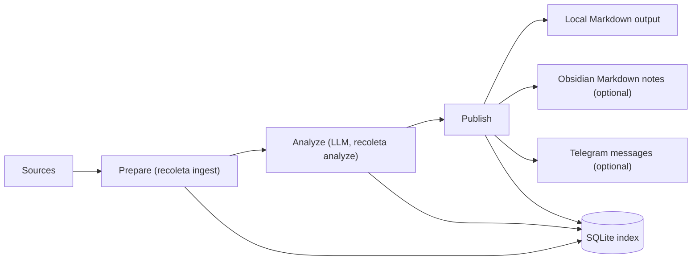

<p align="center">
  
</p>

<!-- Badges (replace with your links) -->
<!-- [](...) -->
<!-- [](...) -->
[](LICENSE)
[](#recoleta-installation)

Recoleta is a **research intelligence funnel** that ingests noisy sources, runs **structured LLM analysis**, and publishes high-signal outputs to **local Markdown by default** (with optional **Obsidian** and **Telegram** integrations) — so you can keep up with research without drowning in tabs.

## 📚 Contents

- [Overview](#recoleta-overview)
- [Features](#recoleta-features)
- [Installation](#recoleta-installation)
- [Usage](#recoleta-usage)
- [Configuration & CLI API](#recoleta-configuration)
- [Contributing](#recoleta-contributing)
- [License](#recoleta-license)

<a id="recoleta-overview"></a>
## 👀 Overview

Recoleta is local-first and single-user by design: it stores durable state in a local **SQLite** index and treats notes/messages as derived artifacts.



<a id="recoleta-features"></a>
## ✨ Features

- **Multi-source ingestion**: arXiv, Hacker News RSS, Hugging Face Daily Papers, OpenReview, and custom RSS feeds.
- **Incremental & idempotent pipeline**: SQLite-backed state machine prevents duplicates and re-sends.
- **Structured LLM outputs**: JSON-only analysis validated by Pydantic (summary/tags/scores).
- **Semantic triage before LLM (optional)**: pre-rank (and optionally filter) candidates by topic similarity to improve LLM ROI under backlog.
- **Outputs where you read**: local Markdown output (default) + optional Obsidian notes + optional curated Telegram digest.
- **Operationally friendly**: structured logs, per-run metrics in SQLite, optional scrubbed debug artifacts.

<a id="recoleta-installation"></a>
## 📦 Installation

### Prerequisites

- **Python**: >= 3.14
- **Package manager**: [`uv`](https://docs.astral.sh/uv/) (recommended)
- **LLM provider** supported by LiteLLM (e.g. OpenAI / Anthropic)
- **Pandoc** (recommended): used to generate `html_document_md` from arXiv `html_document` when available
- **Optional integrations**:
  - Obsidian Vault (for writing notes directly into Obsidian)
  - Telegram Bot token + destination chat ID (for mobile digest)

### Install (from source)

```bash
git clone https://github.com/NeapolitanIcecream/recoleta.git
cd recoleta
uv sync
uv run recoleta --help
```

<a id="recoleta-usage"></a>
## 🧰 Usage

### 🚀 Quick Start

Create a non-secret config file (all sources are disabled by default and must be explicitly enabled).

```bash
# Option A: copy the full example config and edit it
cp recoleta.example.yaml recoleta.yaml

# Option B: create a minimal config from scratch
cat <<'YAML' > recoleta.yaml
# NOTE: This file must NOT contain secrets. Keep tokens/API keys in env only.

recoleta_db_path: "~/.local/share/recoleta/recoleta.db"

# LiteLLM model naming: <provider>/<model-identifier>
# Examples:
# - openai/gpt-4o-mini
# - anthropic/claude-3-5-sonnet-20241022
llm_model: "openai/gpt-4o-mini"

# Publish targets (default: ["markdown"])
# Allowed: markdown, obsidian, telegram
publish_targets:
  - markdown

# Local Markdown output directory (default: platform-specific user data dir + /outputs)
markdown_output_dir: "~/.local/share/recoleta/outputs"

# Optional: language for summary text.
# JSON keys stay in English and topics remain English tags.
llm_output_language: "Chinese (Simplified)"

topics:
  - agents
  - ml-systems

sources:
  hn:
    enabled: true
    rss_urls:
      - "https://news.ycombinator.com/rss"
  rss:
    enabled: true
    feeds:
      - "https://example.com/feed.xml"

# Optional knobs
min_relevance_score: 0.6
max_deliveries_per_day: 10
write_debug_artifacts: false
YAML
```

Create a `.env` file for secrets and the config pointer.

```bash
cat <<'ENV' > .env
RECOLETA_CONFIG_PATH="./recoleta.yaml"

# LLM provider credentials (depends on your llm_model)
OPENAI_API_KEY="sk-replace-me"

# Optional: Telegram publishing (env-only)
# TELEGRAM_BOT_TOKEN="123456789:replace-me"
# TELEGRAM_CHAT_ID="@replace_me"
ENV
```

Run the pipeline end-to-end.

```bash
uv run recoleta ingest
uv run recoleta analyze --limit 50
uv run recoleta publish --limit 20
```

Or run the full pipeline once (no scheduler):

```bash
uv run recoleta run --once --analyze-limit 50 --publish-limit 20
```

Command intent:
- `recoleta ingest`: prepare backlog (ingest + enrich + optional semantic triage)
- `recoleta analyze`: Stage 4 only (LLM on prepared items)
- `recoleta publish`: deliver analyzed items
 - `recoleta run --once`: run `ingest -> analyze -> publish` once and exit

Where to look next:

- **Local Markdown**: `MARKDOWN_OUTPUT_DIR/latest.md` and `MARKDOWN_OUTPUT_DIR/Inbox/`
- **Obsidian notes (optional)**: `OBSIDIAN_VAULT_PATH/OBSIDIAN_BASE_FOLDER/Inbox/`
- **Telegram (optional)**: messages are sent to `TELEGRAM_CHAT_ID`
- **SQLite index**: `RECOLETA_DB_PATH` (safe to re-run; deliveries are idempotent)

### 📈 Trend analysis (daily / weekly / monthly)

Recoleta can generate **trend notes** as a standalone stage:

```bash
uv run recoleta trends
```

Key behaviors:

- **Time windows**: `--date` is an anchor date in **UTC** (`YYYY-MM-DD`).
  - `day`: the UTC calendar day of `--date`
  - `week`: ISO week (Monday start) containing `--date`
  - `month`: calendar month containing `--date`
- **Corpus sources**:
  - `day` trends are generated from **analyzed items** in that day.
  - `week` trends are generated from existing **day trend documents** in that week.
  - `month` trends are generated from existing **week trend documents** in that month.
- **Token-safe**: if the corpus is empty, Recoleta **skips the LLM call** and emits a placeholder trend document.

Examples:

```bash
# Daily trend for today (UTC)
uv run recoleta trends --granularity day

# Daily trend for a specific day (UTC)
uv run recoleta trends --granularity day --date 2026-03-02

# Weekly trend (requires daily trends for that week)
uv run recoleta trends --granularity week --date 2026-03-02

# Monthly trend (requires weekly trends for that month)
uv run recoleta trends --granularity month --date 2026-03-02

# Override the LLM model used for trend generation
uv run recoleta trends --granularity week --model "openai/gpt-4o-mini"
```

Outputs:

- **SQLite**: a durable `trend` document is persisted into `RECOLETA_DB_PATH`.
- **Local Markdown** (when `PUBLISH_TARGETS` includes `markdown`): `MARKDOWN_OUTPUT_DIR/Trends/`
- **Obsidian** (when `PUBLISH_TARGETS` includes `obsidian`): `OBSIDIAN_VAULT_PATH/OBSIDIAN_BASE_FOLDER/Trends/`

Optional knobs (env or config):

- `RAG_LANCEDB_DIR`: where semantic vectors are stored (default: platform user data dir + `/lancedb`)
- `TRENDS_EMBEDDING_MODEL`, `TRENDS_EMBEDDING_DIMENSIONS`
- `TRENDS_EMBEDDING_FAILURE_MODE` (`continue|fail_fast|threshold`) and `TRENDS_EMBEDDING_MAX_ERRORS` (required when `threshold`)

### 🗓️ Run continuously (built-in scheduler)

```bash
uv run recoleta run
```

Tune the intervals via:

- `INGEST_INTERVAL_MINUTES`
- `ANALYZE_INTERVAL_MINUTES`
- `PUBLISH_INTERVAL_MINUTES`

### 🧪 Run manually (cron/launchd-friendly)

```bash
uv run recoleta ingest && uv run recoleta analyze && uv run recoleta publish
```

<a id="recoleta-configuration"></a>
## ⚙️ Configuration & CLI API

### Configuration sources & precedence

Recoleta loads typed settings from:

1. **Init args** (rare; mainly for tests)
2. **Environment variables**
3. **`.env`** in the working directory
4. **Config file** pointed to by `RECOLETA_CONFIG_PATH` (`.yaml`/`.yml`/`.json`)
5. Defaults (for optional fields)

**Secrets rule**: `TELEGRAM_BOT_TOKEN` and `TELEGRAM_CHAT_ID` are forbidden in the config file and must come from environment variables only.

### Settings reference

Required:

- `RECOLETA_DB_PATH` / `recoleta_db_path` (SQLite file path)
- `LLM_MODEL` / `llm_model` (LiteLLM model, format: `<provider>/<model>`)
- `PUBLISH_TARGETS` / `publish_targets` (default: `["markdown"]`)
- `MARKDOWN_OUTPUT_DIR` / `markdown_output_dir` (default: platform-specific data dir + `/outputs`)

Conditionally required:

- `OBSIDIAN_VAULT_PATH` / `obsidian_vault_path` (required when `PUBLISH_TARGETS` includes `obsidian`)
- `TELEGRAM_BOT_TOKEN` (env-only, required when `PUBLISH_TARGETS` includes `telegram`)
- `TELEGRAM_CHAT_ID` (env-only, required when `PUBLISH_TARGETS` includes `telegram`)

Common optional knobs:

- **LLM output language**:
  - `LLM_OUTPUT_LANGUAGE` / `llm_output_language` (applies to `summary`; JSON keys and `topics` stay English)
- **Sources**: `SOURCES` / `sources`
  - `hn.enabled`, `hn.rss_urls`
  - `rss.enabled`, `rss.feeds`
  - `arxiv.enabled`, `arxiv.queries`, `arxiv.max_results_per_run`
  - `arxiv.enrich_method`, `arxiv.enrich_failure_mode`
  - `arxiv.html_document_max_concurrency`, `arxiv.html_document_requests_per_second`
  - `arxiv.html_document_log_sample_rate`
  - `openreview.enabled`, `openreview.venues`
  - `hf_daily.enabled`
- **Relevance & filtering**:
  - `TOPICS` / `topics`
  - `ALLOW_TAGS` / `allow_tags`
  - `DENY_TAGS` / `deny_tags`
  - `MIN_RELEVANCE_SCORE` / `min_relevance_score`
  - `MAX_DELIVERIES_PER_DAY` / `max_deliveries_per_day`
- **Analysis content truncation**:
  - `ANALYZE_CONTENT_MAX_CHARS` / `analyze_content_max_chars` (default: `32768`, set to `0` to disable truncation)
- **Semantic triage (pre-ranking before LLM)** (runs only when `TRIAGE_ENABLED=true` and `TOPICS` is non-empty):
  - `TRIAGE_ENABLED` / `triage_enabled`
  - `TRIAGE_MODE` / `triage_mode` (`prioritize|filter`)
  - `TRIAGE_EMBEDDING_MODEL` / `triage_embedding_model`
  - `TRIAGE_EMBEDDING_DIMENSIONS` / `triage_embedding_dimensions`
  - `TRIAGE_EMBEDDING_BATCH_MAX_INPUTS` / `triage_embedding_batch_max_inputs`
  - `TRIAGE_EMBEDDING_BATCH_MAX_CHARS` / `triage_embedding_batch_max_chars`
  - `TRIAGE_QUERY_MODE` / `triage_query_mode` (`joined|max_per_topic`)
  - `TRIAGE_CANDIDATE_FACTOR` / `triage_candidate_factor`
  - `TRIAGE_MAX_CANDIDATES` / `triage_max_candidates`
  - `TRIAGE_ITEM_TEXT_MAX_CHARS` / `triage_item_text_max_chars`
  - `TRIAGE_MIN_SIMILARITY` / `triage_min_similarity` (filter mode only)
  - `TRIAGE_EXPLORATION_RATE` / `triage_exploration_rate`
  - `TRIAGE_RECENCY_FLOOR` / `triage_recency_floor`
- **Execution limits**:
  - `ANALYZE_LIMIT` / `analyze_limit` (default Stage 4 batch size; also used as Stage 3.5 selection limit)
- **Dedup**:
  - `TITLE_DEDUP_THRESHOLD` / `title_dedup_threshold`
  - `TITLE_DEDUP_MAX_CANDIDATES` / `title_dedup_max_candidates`
- **Outputs**:
  - `PUBLISH_TARGETS` / `publish_targets`
  - `MARKDOWN_OUTPUT_DIR` / `markdown_output_dir`
  - `OBSIDIAN_BASE_FOLDER` / `obsidian_base_folder`
  - `ARTIFACTS_DIR` / `artifacts_dir` (required if `WRITE_DEBUG_ARTIFACTS=true`)
- **Scheduling**:
  - `INGEST_INTERVAL_MINUTES`, `ANALYZE_INTERVAL_MINUTES`, `PUBLISH_INTERVAL_MINUTES`
- **Logging & diagnostics**:
  - `LOG_LEVEL` / `log_level`
  - `LOG_JSON` / `log_json`
  - `WRITE_DEBUG_ARTIFACTS` / `write_debug_artifacts`

### LiteLLM provider credentials

Recoleta delegates LLM calls to LiteLLM. You must provide provider credentials via environment variables. Common examples:

- OpenAI: `OPENAI_API_KEY`
- Anthropic: `ANTHROPIC_API_KEY`
- OpenRouter: `OPENROUTER_API_KEY`
- Custom OpenAI-compatible endpoints (including LiteLLM Proxy): set `OPENAI_API_BASE` (or `OPENAI_BASE_URL`) to the endpoint base URL.
- Custom OpenRouter endpoints: set `OPENROUTER_API_BASE` (or `OPENROUTER_BASE_URL`) to the endpoint base URL.

### Debug artifacts & metrics (optional)

Enable scrubbed debug artifacts:

- Set `WRITE_DEBUG_ARTIFACTS=true`
- Set `ARTIFACTS_DIR=/absolute/path/to/artifacts`

Recoleta writes per-run/per-item JSON artifacts (e.g. failure context and LLM request/response payloads) and **scrubs known secrets** before persisting them.

Recoleta also records lightweight, machine-readable **metrics** into the SQLite `metrics` table (e.g. stage durations, LLM call counts, publish outcomes).

### CLI commands

Recoleta ships a small CLI surface:

- `recoleta ingest`: prepare items for LLM (ingest + enrich + optional triage)
- `recoleta analyze --limit 100`: run structured LLM analysis for prepared items only
- `recoleta publish --limit 50`: write Obsidian notes and send Telegram deliverables
- `recoleta run`: schedule ingest/analyze/publish periodically
- `recoleta trends --granularity week --date 2026-03-02`: generate a trend note (day/week/month)

### Further reading

- [`docs/design/system-overview.md`](docs/design/system-overview.md) — goals, non-goals, and the end-to-end workflow
- [`docs/design/architecture.md`](docs/design/architecture.md) — module boundaries, pipeline stages, storage, and observability
- [`docs/design/configuration.md`](docs/design/configuration.md) — full configuration reference and rules
- [`docs/design/semantic-pre-ranking.md`](docs/design/semantic-pre-ranking.md) — semantic triage before LLM (pre-ranking and optional filtering)
- [`docs/design/outputs.md`](docs/design/outputs.md) — publish targets and local Markdown layout
- [`docs/design/llm-output-language.md`](docs/design/llm-output-language.md) — configurable analysis language behavior
- [`docs/design/data-model.md`](docs/design/data-model.md) — SQLite schema and Obsidian note layout
- [`docs/adr/`](docs/adr/) — architecture decision records (SQLite, LiteLLM, config file, Telegram delivery)

<a id="recoleta-contributing"></a>
## 🤝 Contributing

Install dev dependencies and run checks:

```bash
uv sync --dev
uv run pytest
uv run ruff check .
```

<a id="recoleta-license"></a>
## 📄 License

Licensed under the **Apache License 2.0**. See [`LICENSE`](LICENSE).
