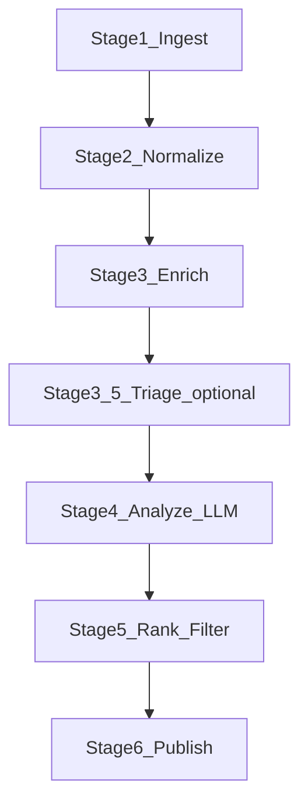

# Architecture

This document describes the current architecture for Recoleta v0: modules, data flow, scheduling, and operational concerns.

For long-running runtime, retention, migration, and deployment concerns, see `docs/design/long-running-operations.md`.

## Runtime shape

Recoleta is a CLI-first application with a small set of commands:

- `recoleta ingest`: run **prepare** work (ingest + enrich + optional triage) and persist a Stage 4-ready backlog. `--date` scopes the run to one UTC day.
- `recoleta analyze`: run **Stage 4 only** (LLM analysis on prepared items); no network enrichment or triage in this command. `--date` scopes the run to one UTC day.
- `recoleta publish`: publish to configured targets (local Markdown by default; optional Obsidian and Telegram). `--date` scopes the run to one UTC day.
- `recoleta trends` / `recoleta trends-week`: generate day/week/month trend documents from analyzed items or lower-granularity trend documents, with optional backfill.
- `recoleta site`: build, stage, or GitHub Pages-deploy a static site from canonical trend markdown notes.
- `recoleta run`: schedule ingest/analyze/publish periodically, or use `run --once --date ...` for a one-shot UTC-day pipeline.
- `recoleta stats`, `recoleta doctor`, `recoleta gc`, `recoleta vacuum`, `recoleta backup`, and `recoleta restore`: read-only diagnostics and maintenance commands for long-running workspaces.

## Module boundaries

Current module layout:

- `recoleta/cli/`: command implementations for ingest, analyze, publish, run, trends, site, RAG, DB, and maintenance commands
- `recoleta/cli.py`: compatibility shim that re-exports the package CLI entry points
- `recoleta/config.py`: typed config, env loading, validation
- `recoleta/sources.py`: source connectors and incremental pull-state helpers (watermarks, ETag, Last-Modified)
- `recoleta/pipeline/`: orchestration, stage implementations, topic-stream handling, metrics, and managed artifacts
- `recoleta/pipeline.py`: compatibility shim that re-exports pipeline service symbols
- `recoleta/extract.py`: fulltext extraction (HTML/PDF), HTML cleanup, and Markdown conversion
- `recoleta/analyzer.py`: LLM invocation via LiteLLM and PydanticAI
- `recoleta/triage.py`: semantic scoring and pre-ranking before LLM (optional)
- `recoleta/storage/`: SQLite schema, repository facade, leases, source state, maintenance, and document helpers
- `recoleta/storage.py`: convenience re-export of the storage facade and shared types
- `recoleta/publish/`: Markdown/Obsidian note writers plus Telegram-facing trend note and PDF rendering helpers
- `recoleta/site.py` and `recoleta/site_deploy.py`: static site export and GitHub Pages branch deployment
- `recoleta/delivery.py`: Telegram sender
- `recoleta/observability.py`: logging setup, debug artifacts, and metrics helpers

## Pipeline stages

Stage flow:

### Stage 1: Ingest

Responsibilities:
- Poll configured sources.
- Reuse persisted source pull state when possible:
  - published-at watermarks for feeds and APIs
  - conditional fetch headers such as `If-None-Match` / `If-Modified-Since` where supported
- Support explicit UTC-day windows passed from CLI `--date`.
- Convert each source record into a normalized `ItemDraft`.
- Compute stable identity keys:
  - `source` + `source_item_id` (if available)
  - `canonical_url_hash` (fallback)
- Upsert into SQLite `items`.

Failure modes:
- Network errors → retry with exponential backoff.
- Parse errors → mark item as `failed_ingest` and persist error metadata.

### Stage 2: Normalize

Responsibilities:
- Normalize fields (title, authors, published_at, url).
- Create derived metadata (domains, arXiv categories, HN score/comment count if available).
- Detect obvious duplicates:
  - exact URL match
  - near-duplicate title via `rapidfuzz` (threshold configurable)

### Stage 3: Enrich (Fulltext/PDF)

Responsibilities:
- For HTML: download and extract main text (e.g., `trafilatura`).
- For PDF: download and extract text/markdown (via `pymupdf4llm`; non-OCR).
- When a date window is requested, select work within that UTC day before applying per-stage limits.
- Persist extracted content to:
  - SQLite `contents` (small text blobs) and/or
  - filesystem artifact store (for larger payloads), with a pointer stored in SQLite.

Operational guidance:
- Cache downloads by URL hash to avoid repeated fetching.
- Never store access tokens inside artifacts.

### Stage 3.5: Triage (Semantic Pre-Ranking) (optional)

Responsibilities:
- Build a candidate pool larger than the Stage 4 limit.
- Score candidates against user-defined `TOPICS` using semantic similarity:
  - embeddings + cosine similarity (recommended)
  - lexical fallback (e.g., `rapidfuzz`) when embeddings are unavailable
- Select items for Stage 4:
  - prioritize mode: rank by similarity and take top-K
  - filter mode (optional): apply a minimum similarity threshold to reduce LLM calls
- Persist Stage 3.5 output by marking selected items as `triaged`, creating a durable handoff into Stage 4.
- Preserve exploration: reserve a small slice of Stage 4 capacity for randomly sampled candidates.
- Fail open: if triage fails, fall back to recency ordering.

Operational guidance:
- Batch embedding calls (`input=[...]`) to control latency and rate limits.
- Keep the candidate factor bounded to avoid excessive enrichment/embedding work.
- See `docs/design/semantic-pre-ranking.md` for scoring and cost-control details.

### Stage 4: Analyze (LLM)

Responsibilities:
- For each prepared item, load **already stored** content (for arXiv, follow the configured enrich method; otherwise prefer `pdf_text`, then `html_maintext`).
- Call LiteLLM to produce structured output:
  - summary
  - topics/tags
  - relevance score against user topics
  - novelty score (optional)
- Persist the analysis record and a prompt+response debug artifact (when configured).

Operational guidance:
- Stage 4 is compute-only. Do not fetch URLs or run extraction in this stage.
- If content is missing, fail fast, mark retryable, and emit machine-readable diagnostics.

LLM interface:
- Use LiteLLM's OpenAI-compatible API.
- Prefer **structured output** (JSON schema / response_format) and validate with Pydantic.

### Stage 5: Rank & Filter

Responsibilities:
- Rank items by a combined score:
  - LLM relevance score
  - source-specific signals (HN points/comments; arXiv recency; OpenReview status)
  - novelty/dedup penalty
- Apply user rules:
  - allow/deny tags
  - minimum score threshold
  - max items per run/day
- Decide final `Deliverable` objects.

### Stage 6: Publish

Responsibilities:
- Write local Markdown notes and a per-run index (`latest.md`) by default.
- Optionally write Obsidian notes in Markdown with YAML frontmatter.
- Optionally send Telegram messages (short mobile-friendly format) with safe rate limiting.
- For trends, persist a canonical markdown note first, then derive the Telegram PDF from that note.
- For trend Telegram delivery, prefer the browser PDF renderer and fall back to the Story renderer when necessary.
- Record delivery results and message IDs for idempotency.

Operational guidance:
- Keep the trend markdown note as the canonical source for downstream surfaces.
- Treat the generated PDF as a delivery artifact, not as the source of truth.
- When `--debug-pdf` is enabled, export the exact HTML/CSS/markdown inputs used for the render.

## Durable pre-ranking boundary

When triage is enabled, Stage 4 consumes `triaged` items (plus `retryable_failed` retries).  
When triage is disabled, Stage 4 consumes `enriched` items (plus `retryable_failed`).  
This keeps Stage 3/3.5 cache-friendly and makes Stage 4 a clean, lazy compute boundary.

## Scheduling and execution model

Two supported modes:

- **External scheduler**: run `recoleta run --once` via cron/launchd/systemd, or use explicit stage commands when finer control is needed.  
  (`ingest` now means prepare: Stage 1 + Stage 3 + Stage 3.5)
- **Internal scheduler**: `recoleta run` uses APScheduler to run jobs on intervals with the same stage mapping.

Windowed catch-up is part of the same execution model:

- `recoleta ingest --date`, `recoleta analyze --date`, and `recoleta publish --date` target one UTC day for manual replays or backfills
- `recoleta run --once --date` threads the same UTC-day window through all three stages
- when no explicit window is requested, the default behavior remains incremental backlog processing

For v0, concurrency should be conservative:
- parallelize network fetches with bounded concurrency
- serialize SQLite writes per transaction
- keep LLM calls bounded to avoid cost spikes
- prefer pre-ranking (Stage 3.5) to keep LLM calls high-signal when backlog exists

## Storage model

Recoleta persists state in two places:

- **SQLite index**: truth source for state machines, dedupe, retries, metrics.
- **Filesystem outputs**:
  - Local Markdown output directory (default, user-facing artifacts)
  - Obsidian Vault notes (user-facing artifacts)
  - trend PDF artifacts derived from canonical markdown notes
  - static site build outputs and repo-local staged trend snapshots
  - optional raw artifacts directory (HTML/PDF/text snapshots, debug JSON)

SQLite enables:
- incremental runs (process only new/changed items)
- persisted source pull state (watermarks, cursors, conditional request metadata)
- delivery idempotency
- auditing and re-processing

## Observability and debugability

Every pipeline stage must emit at least one machine-readable signal:

- **Structured logs** (Loguru): `logger.bind(module="pipeline.ingest", run_id=..., item_id=...)`
  - do not bind unbounded values (full URLs, long filenames) repeatedly
  - never log secrets (tokens, chat IDs, API keys)
- **Metrics in SQLite**:
  - stage duration per run
  - source pull diagnostics such as `filtered_out_total`, `in_window_total`, and `not_modified_total`
  - LLM call counts and errors by provider/model
  - delivered item counts
- **Debug artifacts** (optional):
  - `{run_id}/{item_id}/llm-request.json`
  - `{run_id}/{item_id}/llm-response.json`
  - optional triage artifacts (when enabled): `embedding-request.json`, `embedding-response.json`, `triage-summary.json`
  - optional trend PDF render bundles under `MARKDOWN_OUTPUT_DIR/Trends/.pdf-debug/<pdf-stem>/`
  - scrub secrets before writing

## Error handling and retries

- Use `tenacity` for IO retries (HTTP fetches, Telegram transient errors).
- Classify errors:
  - transient: retry, then mark `retryable_failed`
  - permanent: mark `failed` and stop further stages for that item
- Persist failure context (error type, message, stage) in SQLite for later inspection.
