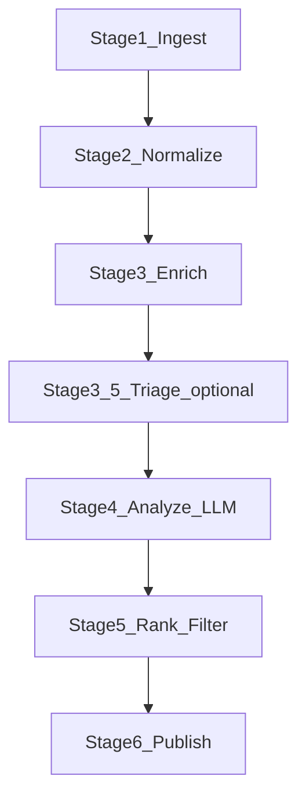

# Architecture

This document describes the current architecture for Recoleta v0: modules, data flow, scheduling, and operational concerns.

For long-running runtime, retention, migration, and deployment concerns, see `docs/design/long-running-operations.md`.

## Runtime shape

Recoleta is a CLI-first application with a small set of commands:

- `recoleta stage ingest`, `recoleta stage analyze`, and
  `recoleta stage publish`: run one primitive at a time. `--date` scopes the
  supported stage to one UTC day.
- `recoleta stage trends` and `recoleta stage ideas`: rerun one day/week/month
  synthesis primitive from stored analyzed or lower-level state.
- `recoleta run now|day|week|month`: workflow-first entry points that
  orchestrate ingest, analyze, publish, downstream trends/ideas, translation,
  and site build according to workflow policy.
- `recoleta run translate`, `recoleta run site build|serve`, `recoleta run
  email preview|send`, and `recoleta run deploy`: derived workflows from
  stored state.
- `recoleta repair outputs`: rebuild Markdown/PDF/site artifacts from stored DB
  state without rerunning ingest/analyze.
- `recoleta daemon start`: run configured workflow schedules locally.
- `recoleta inspect health|stats|runs|llm|why-empty`: operator diagnostics and
  run inspection surfaces.
- `recoleta admin gc|vacuum|backup|restore|db`: maintenance commands for
  long-running workspaces.

Legacy note:

- the older shared `topic_streams` runtime exposed `recoleta repair streams`
- the current instance-first runtime replaces that flow with child-instance
  configs, targeted `stage ...` reruns, and `repair outputs` when the DB is
  already correct

## Module boundaries

Current module layout:

- `recoleta/cli/`: command implementations for workflow, stage, inspection,
  repair, site, RAG, DB, and maintenance commands
- `recoleta/cli.py`: compatibility shim that re-exports the package CLI entry points
- `recoleta/config.py`: typed config, env loading, validation
- `recoleta/sources.py`: source connectors and incremental pull-state helpers (watermarks, ETag, Last-Modified)
- `recoleta/pipeline/`: orchestration, stage implementations, metrics, and managed artifacts
- `recoleta/pipeline.py`: compatibility shim that re-exports pipeline service symbols
- `recoleta/extract.py`: fulltext extraction (HTML/PDF), HTML cleanup, and Markdown conversion
- `recoleta/analyzer.py`: LLM invocation via LiteLLM and PydanticAI
- `recoleta/triage.py`: semantic scoring and pre-ranking before LLM (optional)
- `recoleta/rag/`: vector sync, LanceDB access, semantic search, and trend-agent tool wiring
- `recoleta/storage/`: SQLite schema, repository facade, leases, source state, maintenance, and document helpers
- `recoleta/storage.py`: convenience re-export of the storage facade and shared types
- `recoleta/publish/`: Markdown/Obsidian note writers plus Telegram-facing trend note and PDF rendering helpers
- `recoleta/site.py` and `recoleta/site_deploy.py`: static site export and GitHub Pages branch deployment
- `recoleta/site_email_links.py`: private site companion artifact for manual email link resolution
- `recoleta/trend_email.py`: manual trend email candidate selection, rendering, link resolution, and send workflow
- `recoleta/delivery.py`: Telegram sender plus Resend batch sender
- `recoleta/observability.py`: logging setup, debug artifacts, and metrics helpers

## Pipeline stages

Stage flow:

### Stage 1: Ingest

Responsibilities:
- Poll configured sources.
- Reuse persisted source pull state when possible:
  - published-at watermarks for feeds and APIs
  - conditional fetch headers such as `If-None-Match` / `If-Modified-Since` where supported
- Support explicit UTC-day windows passed from CLI `--date`.
- Convert each source record into a normalized `ItemDraft`.
- Compute stable identity keys:
  - `source` + `source_item_id` (if available)
  - `canonical_url_hash` (fallback)
- Upsert into SQLite `items`.

Failure modes:
- Network errors → retry with exponential backoff.
- Parse errors → mark item as `failed_ingest` and persist error metadata.

### Stage 2: Normalize

Responsibilities:
- Normalize fields (title, authors, published_at, url).
- Create derived metadata (domains, arXiv categories, HN score/comment count if available).
- Detect obvious duplicates:
  - exact URL match
  - near-duplicate title via `rapidfuzz` (threshold configurable)

### Stage 3: Enrich (Fulltext/PDF)

Responsibilities:
- For HTML: download and extract main text (e.g., `trafilatura`).
- For PDF: download and extract text/markdown (via `pymupdf4llm`; non-OCR).
- When a date window is requested, select work within that UTC day before applying per-stage limits.
- Persist extracted content to:
  - SQLite `contents` (small text blobs) and/or
  - filesystem artifact store (for larger payloads), with a pointer stored in SQLite.

Operational guidance:
- Cache downloads by URL hash to avoid repeated fetching.
- Never store access tokens inside artifacts.

### Stage 3.5: Triage (Semantic Pre-Ranking) (optional)

Responsibilities:
- Build a candidate pool larger than the Stage 4 limit.
- Score candidates against user-defined `TOPICS` using semantic similarity:
  - embeddings + cosine similarity (recommended)
  - lexical fallback (e.g., `rapidfuzz`) when embeddings are unavailable
- Select items for Stage 4:
  - prioritize mode: rank by similarity and take top-K
  - filter mode (optional): apply a minimum similarity threshold to reduce LLM calls
- Persist Stage 3.5 output by marking selected items as `triaged`, creating a durable handoff into Stage 4.
- Preserve exploration: reserve a small slice of Stage 4 capacity for randomly sampled candidates.
- Fail open: if triage fails, fall back to recency ordering.

Operational guidance:
- Batch embedding calls (`input=[...]`) to control latency and rate limits.
- Keep the candidate factor bounded to avoid excessive enrichment/embedding work.
- See `docs/design/semantic-pre-ranking.md` for scoring and cost-control details.

### Stage 4: Analyze (LLM)

Responsibilities:
- For each prepared item, load **already stored** content (for arXiv, follow the configured enrich method; otherwise prefer `pdf_text`, then `html_maintext`).
- Call LiteLLM to produce structured output:
  - summary
  - topics/tags
  - relevance score against user topics
  - novelty score (optional)
- Persist the analysis record and a prompt+response debug artifact (when configured).

Operational guidance:
- Stage 4 is compute-only. Do not fetch URLs or run extraction in this stage.
- If content is missing, fail fast, mark retryable, and emit machine-readable diagnostics.

LLM interface:
- Use LiteLLM's OpenAI-compatible API.
- Prefer **structured output** (JSON schema / response_format) and validate with Pydantic.

### Stage 5: Rank & Filter

Responsibilities:
- Rank items by a combined score:
  - LLM relevance score
  - source-specific signals (HN points/comments; arXiv recency; OpenReview status)
  - novelty/dedup penalty
- Apply user rules:
  - allow/deny tags
  - minimum score threshold
  - max items per run/day
- Decide final `Deliverable` objects.

### Stage 6: Publish

Responsibilities:
- Write local Markdown notes and a per-run index (`latest.md`) by default.
- Optionally write Obsidian notes in Markdown with YAML frontmatter.
- Optionally send Telegram messages (short mobile-friendly format) with safe rate limiting.
- For trends, persist a canonical markdown note first, then derive the Telegram PDF from that note.
- For trend Telegram delivery, prefer the browser PDF renderer and fall back to the Story renderer when necessary.
- Record delivery results and message IDs for idempotency.

Non-goal:

- manual trend email is not part of Stage 6 publish. It is an explicit
  operator-triggered derived workflow that runs later from stored markdown,
  sidecars, site link-map artifacts, and delivery state.

Operational guidance:
- Keep the trend markdown note as the canonical source for downstream surfaces.
- Treat the generated PDF as a delivery artifact, not as the source of truth.
- When `--debug-pdf` is enabled, export the exact HTML/CSS/markdown inputs used for the render.

## Trend generation sibling flow

Trend generation is a sibling pipeline, not just an extra publish target:

- `recoleta trends` builds or refreshes a document corpus (`documents` + `document_chunks`) from analyzed items or lower-granularity trend docs.
- Semantic search uses a local LanceDB workspace to retrieve related summaries and representative sources for clusters.
- Optional overview packs (`TRENDS_SELF_SIMILAR_ENABLED`) and bounded peer-history packs (`TRENDS_PEER_HISTORY_ENABLED`) are injected into the trend agent prompt before the final payload is materialized.
- `recoleta repair outputs` can rerender canonical markdown notes, PDFs, and
  site output from stored trend documents after the fact.

## Durable pre-ranking boundary

When triage is enabled, Stage 4 consumes `triaged` items (plus `retryable_failed` retries).  
When triage is disabled, Stage 4 consumes `enriched` items (plus `retryable_failed`).  
This keeps Stage 3/3.5 cache-friendly and makes Stage 4 a clean, lazy compute boundary.

## Scheduling and execution model

Two supported modes:

- **External scheduler**: run `recoleta run now` or
  `recoleta run day --date ...` via cron/launchd/systemd, or use explicit stage
  commands when finer control is needed.
- **Internal scheduler**: `recoleta daemon start` runs configured workflows from
  `DAEMON.schedules`.

Windowed catch-up is part of the same execution model:

- `recoleta stage ingest --date`, `recoleta stage analyze --date`, and
  `recoleta stage publish --date` target one UTC day for manual replays or
  backfills
- `recoleta run day --date` threads the same UTC-day window through the
  workflow
- `recoleta run week --date` and `recoleta run month --date` extend that replay
  model across higher-level recursive windows
- when no explicit window is requested, the default behavior remains incremental backlog processing

For v0, concurrency should be conservative:
- parallelize network fetches with bounded concurrency
- serialize SQLite writes per transaction
- keep LLM calls bounded to avoid cost spikes
- prefer pre-ranking (Stage 3.5) to keep LLM calls high-signal when backlog exists

## Storage model

Recoleta persists state in two places:

- **SQLite index**: truth source for state machines, dedupe, retries, metrics.
- **LanceDB cache**: rebuildable local vector store used by trend semantic search and manual `recoleta rag *` maintenance commands.
- **Filesystem outputs**:
  - Local Markdown output directory (default, user-facing artifacts)
  - Obsidian Vault notes (user-facing artifacts)
  - trend PDF artifacts derived from canonical markdown notes
  - static site build outputs and repo-local staged trend snapshots
  - optional raw artifacts directory (HTML/PDF/text snapshots, debug JSON)

SQLite enables:
- incremental runs (process only new/changed items)
- persisted source pull state (watermarks, cursors, conditional request metadata)
- latest analyses, documents, chunks, deliveries, and run metadata for one child instance
- delivery idempotency
- auditing and re-processing

## Observability and debugability

Every pipeline stage must emit at least one machine-readable signal:

- **Structured logs** (Loguru): `logger.bind(module="pipeline.ingest", run_id=..., item_id=...)`
  - do not bind unbounded values (full URLs, long filenames) repeatedly
  - never log secrets (tokens, chat IDs, API keys)
- **Metrics in SQLite**:
  - stage duration per run
  - source pull diagnostics such as `filtered_out_total`, `in_window_total`, and `not_modified_total`
  - LLM call counts and errors by provider/model
  - delivered item counts
  - trend context-pack metrics such as history-window availability and overview-pack truncation
- **Debug artifacts** (optional):
  - `{run_id}/{item_id}/llm-request.json`
  - `{run_id}/{item_id}/llm-response.json`
  - optional triage artifacts (when enabled): `embedding-request.json`, `embedding-response.json`, `triage-summary.json`
  - optional trend PDF render bundles under `MARKDOWN_OUTPUT_DIR/Trends/.pdf-debug/<pdf-stem>/`
  - optional trend-agent debug payloads including raw tool traces and context-pack stats
  - scrub secrets before writing
- **Artifact summaries in SQLite**:
  - `artifacts.details_json` stores a small structured summary when an artifact
    represents a failure, for example `error_type`, `error_category`,
    `http_status`, `retryable`, and `message_excerpt`
  - `runs show` aggregates those summaries into a run-level failure view without
    requiring the operator to open artifact files first

## Error handling and retries

- Use `tenacity` for IO retries (HTTP fetches, Telegram transient errors).
- Classify errors:
  - transient: retry, then mark `retryable_failed`
  - permanent: mark `failed` and stop further stages for that item
- Persist failure context (error type, message, stage) in SQLite for later inspection.
- For operator ergonomics, key CLI commands also expose machine-readable JSON
  output instead of requiring log scraping.
