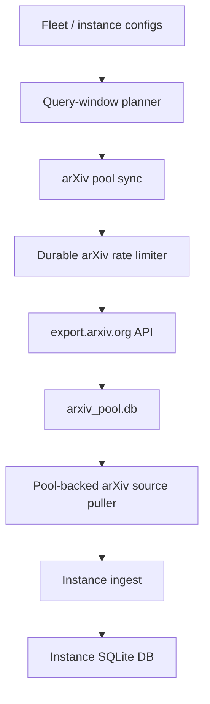

# arXiv Paper Pool Feature Design

Status: Implemented MVP

Date: 2026-05-14

Related note: `docs/design/arxiv-429-access-strategy.md`

## Summary

Add an arXiv paper pool: a shared, rate-limited metadata cache that is the only
Recoleta component allowed to call the arXiv API. Instance-local ingest reads
paper drafts from the pool instead of querying arXiv directly.

The pool turns arXiv from an instance-local source into shared fleet
infrastructure. It keeps upstream access polite, makes backfills deterministic,
and prevents one 429 event from being amplified across every day and every
instance in a fleet run.

The implemented MVP keeps direct arXiv ingest as the default and adds an
explicit pool mode:

- `ARXIV_POOL.enabled=true` with an explicit `ARXIV_POOL.db_path`.
- `SOURCES.arxiv.mode=pool` to make ingest read cached windows only.
- `recoleta arxiv-pool sync` and `backfill` to populate the shared pool.
- Fleet pre-sync when every arXiv-enabled child instance uses pool mode and
  points at the same pool database.
- Pool-local durable rate state and a pool-local sync lease so concurrent sync
  commands cannot issue overlapping arXiv API requests.

## Background

The W18 local fleet ingest run showed the current failure mode clearly:

- `embodied_ai` and `software_intelligence` each ran seven day-scoped ingest
  invocations for `2026-04-27` through `2026-05-03`.
- Both instances hit arXiv source-pull HTTP 429 on all seven days.
- The RSS-only `cross_platform` instance completed without arXiv 429.

The current workflow expands a week into day invocations, and each child
instance owns its own source pull state. The arXiv puller creates a fresh
`arxiv.Client()` for each pull. That gives each day/instance a local retry loop
but no durable cross-run cooldown, no shared cache, and no shared rate state.

This is not a volume problem under the current fleet configuration. Today the
two arXiv-enabled instances have one query each and `max_results_per_run: 60`,
so a single daily sync normally needs one API page per query. Under the arXiv
legacy API limit of one request every three seconds and one connection at a
time, the current two-query daily workload should finish in seconds, not hours.

## Goals

- Route all arXiv API access through one local component with durable rate state.
- Respect arXiv's legacy API constraints: one connection and at least three
  seconds between requests across the whole local installation.
- Cache arXiv metadata and query-window matches so repeated instance runs and
  backfills do not refetch the same data.
- Let existing instance-local pipelines continue to own their `items`,
  `contents`, analyses, trends, and outputs.
- Make arXiv failure modes machine-readable: upstream requests, 429s,
  cooldowns, cache hits, cache misses, and skipped windows.
- Preserve current query semantics for configured instance queries and
  date-scoped workflow windows.

## Non-goals

- Do not bypass arXiv rate limits with fake browser headers, proxies, multiple
  machines, or browser automation.
- Do not redistribute PDFs, source tarballs, or full text through the pool.
  Metadata and abstracts are the initial scope.
- Do not replace HN, Hugging Face, RSS, OpenReview, or RAG storage.
- Do not make fleet instances share their primary SQLite item databases.
- Do not require an always-on daemon for correctness. Scheduled sync is useful,
  but one-shot CLI sync must remain enough.

## User-facing Behavior

Add an opt-in pool mode first. Config files may use either the uppercase
environment-style keys below or the equivalent lowercase field names:

```yaml
ARXIV_POOL:
  enabled: true
  db_path: /path/to/fleet/arxiv_pool.db
  request_interval_seconds: 5
  cooldown_seconds: 3600

SOURCES:
  arxiv:
    enabled: true
    mode: pool
    queries:
      - ...
    max_results_per_run: 60
```

Implemented CLI surfaces:

- `recoleta arxiv-pool sync --date YYYY-MM-DD`: sync all configured arXiv
  query windows for one day.
- `recoleta arxiv-pool sync --date YYYY-MM-DD --lookback-days 3`: refresh a
  recent trailing window to catch delayed metadata and updates.
- `recoleta arxiv-pool backfill --start YYYY-MM-DD --end YYYY-MM-DD`: fill
  historical query windows under the same global limiter.
- `recoleta inspect arxiv-pool freshness`: report latest completed windows,
  cooldown state, upstream requests, 429s, and cache coverage.
- `recoleta admin arxiv-pool gc`: prune old query-match rows while preserving
  paper metadata.

Fleet behavior:

- `recoleta fleet run day|week|month` pre-syncs the pool once before running
  child instances when every arXiv-enabled child uses `mode: pool` and all
  arXiv-enabled children share the same pool DB path.
- Child instances then ingest from local pool rows only. Instance ingest should
  record zero upstream arXiv API requests in this mode.
- If the pool is in cooldown, fleet ingest should either use cached windows or
  record a clean `arxiv_pool_window_unavailable` diagnostic. It should not fall
  back to direct arXiv calls unless explicitly configured.

## Architecture



Main components:

- `recoleta.arxiv_pool.ArxivPoolStore`: owns the shared SQLite schema,
  query-window state, rate state, and sync lease.
- `recoleta.arxiv_pool.ArxivPoolSync`: executes upstream requests under the
  durable limiter and sync lease.
- `recoleta.source_pullers._ArxivPoolPuller`: maps cached query-window matches
  into `ItemDraft` objects for the existing ingest stage.
- `recoleta.cli.arxiv_pool`: renders sync, backfill, freshness, and GC command
  output.

The implementation can initially keep using the `arxiv` package for response
parsing, but the pool should own retry and cooldown policy. If the package does
not expose enough control over `Retry-After` and retry timing, use a thin
`httpx` Atom fetcher for pool sync and parse the feed explicitly.

## Data Model

The pool should live in a separate SQLite database by default so multiple child
instances can share it without merging their primary item stores.

### `arxiv_papers`

- `arxiv_id` primary key, normalized without the `arXiv:` prefix
- `version`
- `canonical_url`
- `title`
- `abstract`
- `authors_json`
- `primary_category`
- `categories_json`
- `published_at`
- `updated_at`
- `comment`
- `journal_ref`
- `doi`
- `raw_atom_json`
- `first_seen_at`
- `last_seen_at`

### `arxiv_queries`

- `id` primary key
- `fingerprint` unique, derived from normalized query text
- `query_text`
- `created_at`
- `updated_at`

### `arxiv_query_windows`

- `query_id`
- `period_start`
- `period_end`
- `max_results`
- `status`: `pending|completed|rate_limited|failed`
- `requested_at`
- `completed_at`
- `cooldown_until`
- `upstream_requests_total`
- `upstream_status`
- `error_category`
- `error_message`
- `result_count`

Unique key: `(query_id, period_start, period_end, max_results)`.

### `arxiv_query_matches`

- `query_id`
- `period_start`
- `period_end`
- `max_results`
- `arxiv_id`
- `sort_position`
- `matched_at`

Unique key: `(query_id, period_start, period_end, max_results, arxiv_id)`.

### `arxiv_rate_state`

Singleton durable limiter state:

- `name`: `arxiv_api`
- `last_request_at`
- `cooldown_until`
- `consecutive_429_total`
- `last_status`
- `last_error_message`

The limiter should be protected by the existing SQLite lease pattern or a small
pool-local lease so concurrent commands cannot send simultaneous arXiv
requests.

### `arxiv_pool_leases`

Implemented pool-local lease state:

- `name`: primary key, currently `arxiv_pool_sync`
- `owner_token`
- `acquired_at`
- `expires_at`

`ArxivPoolSync` acquires this lease for each sync/backfill batch and releases it
on completion, including rate-limited and failed batches.

## Rate-limit Budget

Let:

- `Q` = configured arXiv queries for the day
- `P` = API pages needed per query window
- `N = Q * P` = upstream API requests
- `I` = request interval in seconds

Approximate sync time:

```text
max(0, N - 1) * I + upstream_latency
```

For the current local fleet:

- `Q = 2`
- `max_results_per_run = 60` for both queries
- `P = 1` in the normal case
- `N = 2`

Expected duration:

- At the official minimum interval, `I = 3s`: roughly one interval plus network
  latency.
- At a safer default, `I = 5s`: roughly `5-15s`.
- At a very conservative interval, `I = 15s`: roughly `15-35s`.

Therefore the current two-query daily workload can comfortably finish within a
day. Even a much larger future setup is feasible: 1,000 API pages at one
request every five seconds is about 83 minutes, before network latency. If
Recoleta ever approaches bulk-scale metadata collection, the design should
switch that workload to OAI-PMH or an official bulk data path instead of
stretching the search API.

## Failure Semantics

On HTTP 429:

- Record the failed window as `rate_limited`.
- Persist `cooldown_until`, using `Retry-After` when present and otherwise a
  configured conservative cooldown.
- Stop the current arXiv sync batch unless the remaining windows are already
  fully cached.
- Do not let instance ingest fall back to direct arXiv API calls by default.

On non-429 transient failures:

- Mark the query window `failed` with `error_category` and `error_message`.
- Add bounded exponential backoff before widening pool sync beyond the current
  `arxiv` package fetcher.
- Preserve existing completed windows so instance ingest can still proceed from
  cache where possible.

On cache miss:

- Return a structured source diagnostic rather than raising an opaque source
  failure.
- Include query fingerprint, period bounds, and pool freshness in debug output.

## Integration Plan

### Phase 1: Metadata pool MVP

- Add pool settings and validation. Done.
- Add pool SQLite schema and repository helpers. Done.
- Add one-shot daily sync for configured arXiv queries. Done.
- Add pool-backed source puller that returns `ItemDraft` objects from cached
  matches. Done.
- Add inspect output for freshness and rate state. Done.
- Keep direct arXiv mode available as the default during rollout. Done.

### Phase 2: Fleet integration and cooldowns

- Add fleet pre-sync when child arXiv sources use pool mode and share one pool
  DB path. Done.
- Add durable rate limiter, cooldown behavior, and sync lease. Done.
- Add metrics and diagnostics for upstream requests, cache hits, cache misses,
  429s, skipped windows, and cooldown state. Partially done: sync/backfill
  command payloads and pool DB rows expose these values; ingest emits
  source-scoped metrics for pool draft counts and unavailable windows.
- Make W18-style week runs use cached arXiv rows without touching upstream
  arXiv from child instances. Done for pool-mode child ingest; direct mode
  remains available and default.

### Phase 3: Backfill and retention

- Add historical backfill with resumable windows. Done for day-window backfill;
  progress rendering remains future polish.
- Add trailing lookback refresh for late updates.
- Add GC that can drop old query-window match rows while retaining papers still
  referenced by active instance outputs. Partially done: GC prunes old match
  rows and preserves paper metadata; cross-instance reference tracing is future
  work.

### Phase 4: Optional content policy

- Evaluate whether a separate content cache is worthwhile.
- Keep `/html` and `/pdf` fetching separate from metadata sync because those use
  different hosts, constraints, and licensing concerns.
- If implemented, default to stored metadata plus arXiv links; only cache full
  text when policy and license checks allow it.

## Observability

Metrics and diagnostics should include:

- `pipeline.arxiv_pool.upstream_requests_total`
- `pipeline.arxiv_pool.upstream_429_total`
- `pipeline.arxiv_pool.cooldown_active_total`
- `pipeline.arxiv_pool.window.completed_total`
- `pipeline.arxiv_pool.window.rate_limited_total`
- `pipeline.arxiv_pool.window.failed_total`
- `pipeline.arxiv_pool.cache_hit_total`
- `pipeline.arxiv_pool.cache_miss_total`
- `pipeline.ingest.source.arxiv.pool_drafts_total`
- `pipeline.ingest.source.arxiv.pool_window_unavailable_total`

Implemented MVP signals:

- The pool database stores per-window `status`, `upstream_requests_total`,
  `upstream_status`, `cooldown_until`, `error_category`, `error_message`, and
  `result_count`.
- `arxiv-pool sync` and `backfill` return machine-readable JSON with upstream
  request counts, cache hits/misses, 429s, skipped windows, failures, and paper
  totals.
- Pool-backed ingest records `pipeline.ingest.source.arxiv.pool_drafts_total`
  and `pipeline.ingest.source.arxiv.pool_window_unavailable_total` in the
  existing metrics table.

Inspect output should show:

- current cooldown state
- last upstream request time and status
- completed windows by query
- stale or missing windows for configured instances
- estimated number of upstream requests needed for a requested date range

## Acceptance Criteria

- A pool daily sync for the current two-query fleet performs at most two arXiv
  API requests when both query windows are uncached.
- A repeated daily sync for the same windows performs zero arXiv API requests
  unless forced.
- A W18 fleet run with pre-synced pool rows performs zero arXiv API requests
  from child instance ingest.
- If arXiv returns 429, the pool records `cooldown_until` and subsequent
  instance ingest does not issue direct upstream arXiv calls.
- Pool-backed arXiv ingest produces the same `ItemDraft` identity fields as
  direct arXiv ingest: `source=arxiv`, stable `source_item_id`, canonical arXiv
  URL, title, authors, `published_at`, and raw metadata.
- Tests cover daily sync, repeated cache hit, 429 cooldown, pool-backed ingest,
  and fleet pre-sync planning.

Implemented test coverage:

- `tests/test_arxiv_pool.py` covers daily sync request count, repeated cache
  hits, 429 cooldown, real `arxiv.HTTPError(status=429)` mapping, sync lease
  protection, pool-backed ingest identity fields, unavailable-window
  diagnostics, lookback planning, and fleet pre-sync planning/execution.
- `tests/test_recoleta_specs_settings.py` covers pool config validation and
  `SOURCES.arxiv.mode=pool`.
- `tests/test_cli_v2_surface.py` covers the public CLI routes for the new pool
  commands.

## Risks and Open Questions

- Query normalization must not accidentally change arXiv search semantics.
- Query text changes should create a new query fingerprint instead of mutating
  historical match rows.
- A global user cache is convenient, but a fleet-local cache is easier to reason
  about for reproducible backfills. The MVP requires an explicit shared
  `ARXIV_POOL.db_path` for fleet pre-sync; an automatic fleet-local default can
  be added later if needed.
- If many instances share broad overlapping queries, dedup by `arxiv_id` should
  keep storage small, but query-window match rows can still grow and need GC.
- The migration path from direct mode to pool mode should be explicit: direct
  mode remains available until pool diagnostics prove stable in local fleet
  runs.
