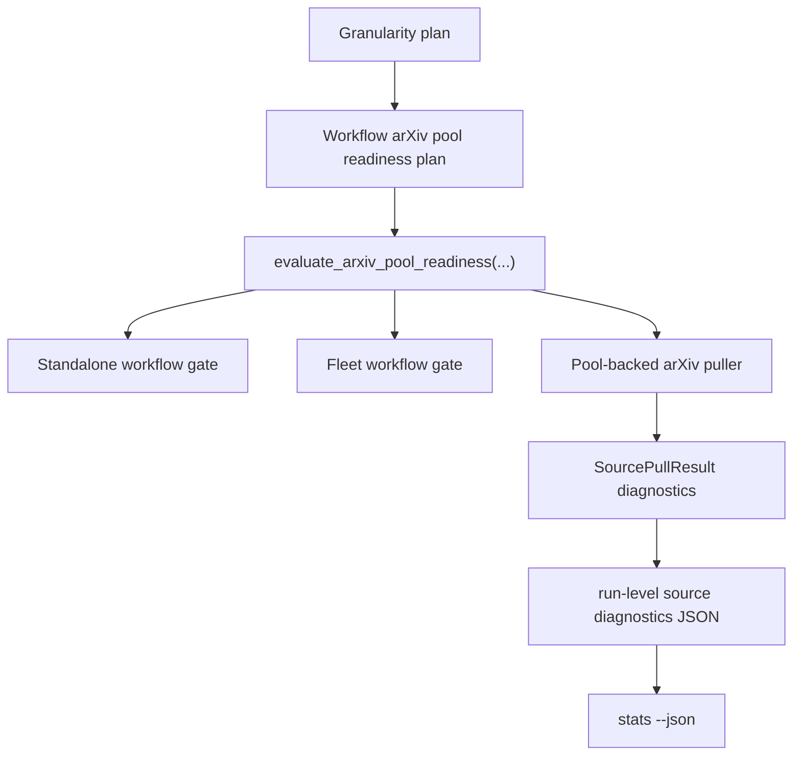

# arXiv Pool Maturity Gate Follow-up Proposal

Status: Proposed

Date: 2026-05-20

Related notes:

- `docs/design/arxiv-pool-maturity-gate.md`
- `docs/design/arxiv-paper-pool.md`
- `docs/design/arxiv-pool-worker.md`

## Summary

This note closes two gaps left by the first arXiv pool maturity-gate
implementation:

- `strict` readiness is enforced in fleet workflows, but not yet in standalone
  `run day|week|month` workflows.
- pool-backed ingest records aggregate maturity counters, but not structured
  window-level diagnostics that explain which arXiv window was blocked and why.

The follow-up keeps the original readiness model unchanged:

- immature pool windows remain excluded from ingest by default;
- `strict` remains the default production policy;
- completed, cache-readable, mature windows remain analysis-ready even if a
  later refresh attempt reports a transient failure.

What changes here is where the readiness decision is enforced and how that
decision is surfaced to operators.

## Background

`docs/design/arxiv-pool-maturity-gate.md` established two layers of protection:

- an ingest-level safety rule: pool-backed arXiv ingest should not emit drafts
  from immature windows by default;
- a workflow-level rule: default `strict` mode should stop analysis when
  required arXiv windows are not analysis-ready.

The first implementation delivered most of that shape:

- `ArxivPoolReadinessPolicy` exists;
- inspect output exposes readiness annotations;
- pool-backed ingest filters immature windows by default;
- fleet workflows can block on arXiv pool readiness in `strict` mode.

Two gaps remain:

- standalone granularity workflows still treat `strict` as an ingest-only rule
  and can continue into analysis with omitted arXiv windows;
- ingest stats expose only counters such as
  `pool_window_immature_total`, which are not enough to debug which query or
  UTC day window caused the omission.

## Problem

### 1. Standalone `strict` is weaker than fleet `strict`

Today, a standalone workflow can run with the default production config:

```yaml
arxiv_pool:
  maturity_lag_days: 1
  readiness_gate: strict
  allow_immature_windows: false
```

If the target period includes an immature arXiv day window:

- ingest correctly omits drafts from that window;
- but the workflow can still continue into analyze and publish with a partial
  arXiv corpus.

That makes `strict` mean different things in different entry points. The
proposal did not intend a fleet-only guarantee. It intended a production-wide
guarantee whenever `sources.arxiv.mode=pool`.

### 2. Counter-only diagnostics are not sufficient

The current ingest metrics can tell us that one window was immature or
unavailable, but they cannot answer:

- which arXiv query was affected;
- which UTC day window was affected;
- whether the window was immature, missing, failed, or available only through
  an unsafe override;
- whether the run was `off`, `warn`, or `strict`.

For operations and incident review, these details need to be machine-readable.
They should not be reconstructed from logs.

## Goals

- Make default `strict` behavior consistent between fleet and standalone
  granularity workflows.
- Keep ingest-only safety behavior unchanged: immature windows still do not
  enter the instance database by default.
- Add structured, window-level arXiv pool diagnostics to ingest results and
  stats output.
- Preserve existing low-cardinality metrics for dashboards and alerts.

## Non-goals

- Do not change the meaning of `mature`, `cache_readable`, or
  `analysis_ready`.
- Do not change worker fetch behavior.
- Do not encode per-window identity into metric names.
- Do not block workflows that are explicitly ingest-only.

## Proposed Behavior

### 1. Shared workflow readiness gate

Add a workflow-scoped readiness check for standalone `run day`, `run week`, and
`run month` workflows when all of these are true:

- `sources.arxiv.enabled=true`;
- `sources.arxiv.mode=pool`;
- the final workflow plan includes any analysis-dependent step.

Analysis-dependent steps are:

- `analyze`
- `publish`
- `trends:day`, `trends:week`, or `trends:month`
- `ideas:day`, `ideas:week`, or `ideas:month`
- `translate`
- `site-build`

The check must run after include/skip overrides have been applied. This prevents
a run such as `run day --skip analyze` from bypassing `strict` mode while still
publishing or synthesizing outputs from an incomplete arXiv corpus.

The readiness evaluation should reuse the same model already used in fleet:

- derive the workflow target period from the granularity plan;
- build the required arXiv pool windows for that period;
- evaluate them with `evaluate_arxiv_pool_readiness(...)`;
- decide whether the workflow may proceed from the resulting payload.

Mode behavior:

| Mode | Standalone workflow behavior |
| --- | --- |
| `off` | Do not block. Continue as today. |
| `warn` | Do not block. Continue, but include readiness diagnostics in workflow JSON and operator-facing stats. |
| `strict` | If any required window is blocked, stop the workflow before the managed step loop begins. |

Important scope rule:

- this workflow-level gate applies only when the final `requested_steps` contains
  an analysis-dependent step;
- ingest-only runs are the runs where no analysis-dependent step remains in the
  final plan, and they remain allowed because the ingest-level maturity filter is
  already the safety boundary for those runs.

This keeps behavior aligned with the original proposal:

- no immature arXiv drafts enter ingest by default;
- `warn` means "continue without those drafts";
- `strict` means "do not produce analysis from a workflow missing required
  arXiv windows."

### 2. Structured ingest diagnostics

Pool-backed ingest should continue to emit aggregate counters such as:

- `pool_window_immature_total`
- `pool_window_unavailable_total`
- `pool_window_analysis_ready_total`
- `pool_window_immature_allowed_total`

In addition, it should emit run-scoped structured diagnostics for each arXiv
pool window it evaluates.

Recommended carrier:

- extend `SourcePullResult` with a `diagnostics` collection;
- persist the source-level diagnostics payload on the run as JSON;
- merge diagnostics into that run-scoped JSON instead of overwriting it;
- let `stats --json` merge metric totals with that stored JSON instead of trying
  to derive window identities from metric names.

Each diagnostic entry should be bounded to one requested pool window and should
include fields such as:

```json
{
  "source": "arxiv",
  "kind": "pool_window_readiness",
  "query_text": "cat:cs.LG",
  "period_start": "2026-05-20T00:00:00+00:00",
  "period_end": "2026-05-21T00:00:00+00:00",
  "max_results": 60,
  "record_status": "completed",
  "cache_readable": true,
  "mature": false,
  "analysis_ready": false,
  "blocked_reason": "immature_window",
  "readiness_gate": "warn",
  "allow_immature_windows": false
}
```

This payload is intentionally window-scoped, not paper-scoped. It should remain
small for supported `day`, `week`, and `month` workflows and safe to expose in
JSON stats.

Run-level merge semantics:

- `source_diagnostics_json` is cumulative for the current workflow run.
- A `day` workflow usually appends one ingest payload.
- A `week` or `month` workflow may run many day-level ingest steps in the same
  run, so each ingest must merge its window diagnostics into the existing stored
  payload instead of replacing earlier entries.
- Window diagnostics are identified by
  `source + kind + query_text + period_start + period_end + max_results`.
- If the same window identity is recorded more than once in one run, the latest
  diagnostic for that identity replaces the older one. Different windows are
  preserved.

### 3. Stats and workflow JSON surfaces

`stats --json` should expose these diagnostics under the existing source
diagnostics payload, for example:

```json
{
  "source_diagnostics": {
    "sources": {
      "arxiv": {
        "status": "ready",
        "ingest": {
          "pool_window_immature_total": 1,
          "pool_window_unavailable_total": 0,
          "window_diagnostics": [
            {
              "kind": "pool_window_readiness",
              "query_text": "cat:cs.LG",
              "period_start": "2026-05-20T00:00:00+00:00",
              "period_end": "2026-05-21T00:00:00+00:00",
              "max_results": 60,
              "blocked_reason": "immature_window"
            }
          ]
        }
      }
    }
  }
}
```

The workflow-level readiness check should also expose its own payload in JSON
output so operators can see why a standalone `strict` workflow was blocked
before any step ran.

## Architecture

Add a small shared workflow-readiness layer rather than keeping this logic only
inside fleet.



Implementation guidance:

- move the workflow-level readiness planning into a shared helper that is not
  fleet-specific;
- let both fleet and standalone workflows call the same helper;
- evaluate the standalone gate from the final granularity plan after include/skip
  step overrides have been resolved;
- keep `evaluate_arxiv_pool_readiness(...)` as the single readiness evaluator;
- extend `SourcePullResult` to carry structured diagnostics in addition to
  `extra_metrics`;
- persist and merge the diagnostics as run-scoped JSON so CLI stats can report
  them directly.

Preferred persistence shape:

- add `source_diagnostics_json` to `Run`, defaulting to `{}`;
- add a startup-safe schema migration and bump the workspace schema version;
- merge each ingest's source diagnostics into that JSON at the end of ingest;
- keep metric recording unchanged for counters and timestamps.

This keeps metrics low-cardinality while giving JSON clients a structured place
to inspect window-level readiness decisions.

## Failure Semantics

This follow-up does not change readiness semantics:

- `completed + cache_readable + mature` remains analysis-ready;
- a later refresh `failed` or `rate_limited` status does not block analysis if
  the readable completed cache still exists;
- an immature completed window is still a readiness blocker in `strict` mode
  unless an explicit unsafe override is active.

The new diagnostics should make these distinctions explicit instead of forcing
operators to infer them from counters alone.

## Acceptance Criteria

- Standalone `run day`, `run week`, and `run month` workflows block in default
  `strict` mode when required arXiv pool windows are not analysis-ready and
  any analysis-dependent step remains in the final workflow plan.
- Standalone ingest-only runs do not block on the workflow-level gate.
- Fleet and standalone workflows make the same readiness decision for the same
  target period and settings.
- Pool-backed ingest continues to record existing maturity counters.
- Pool-backed ingest also records per-window structured readiness diagnostics.
- Week and month ingest diagnostics accumulate across all day-level ingest steps
  in the same workflow run instead of only reporting the last ingest step.
- `stats --json` exposes those diagnostics in a machine-readable source payload.
- A readable completed mature cache remains analysis-ready even when a later
  refresh attempt records a transient failure.

## Test Plan

Add focused tests for the missing behavior:

- `test_run_day_strict_blocks_before_analysis_when_arxiv_pool_not_ready`
- `test_run_day_strict_blocks_when_analyze_skipped_but_publish_requested`
- `test_run_week_strict_blocks_before_analysis_when_any_day_window_not_ready`
- `test_run_day_warn_continues_with_readiness_payload`
- `test_run_day_ingest_only_does_not_block_on_workflow_readiness`
- `test_arxiv_pool_puller_records_structured_window_diagnostics`
- `test_run_week_merges_arxiv_pool_window_diagnostics_across_day_ingests`
- `test_stats_json_reports_arxiv_pool_window_diagnostics`
- `test_fleet_and_standalone_readiness_decisions_match_for_same_period`

Use fixed UTC clocks and deterministic pool fixtures. Do not rely on local
timezone behavior.

## Rollout

1. Extract a shared workflow readiness helper from the existing fleet logic.
2. Apply it to standalone granularity workflows.
3. Extend `SourcePullResult` and ingest persistence with structured diagnostics.
4. Add the run-level JSON column, schema migration, and merge helper.
5. Teach `stats --json` to read the stored source diagnostics payload.
6. Keep existing maturity counters unchanged so dashboards do not break.
