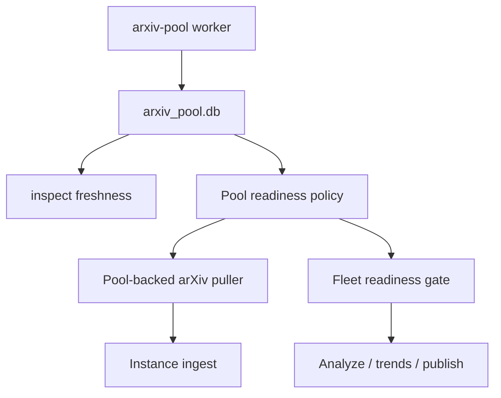

# arXiv Pool Maturity Gate Proposal

Status: Proposed

Date: 2026-05-20

Related notes:

- `docs/design/arxiv-paper-pool.md`
- `docs/design/arxiv-pool-worker.md`
- `docs/design/arxiv-pool-fetcher-control.md`
- `docs/design/arxiv-429-access-strategy.md`

## Summary

Add a maturity gate for arXiv pool windows so Recoleta does not treat a
successfully fetched current-day window as analysis-ready before the UTC day has
closed.

The arXiv pool worker may continue to warm and refresh today's window. That is
useful for cache freshness and for catching results quickly. But ingest and
fleet analysis should distinguish these states:

- `completed`: the pool successfully fetched and cached the window at least
  once.
- `mature`: the window's UTC period is old enough to be considered complete.
- `cache_readable`: the completed window has a complete readable cache for its
  recorded result count.
- `analysis_ready`: the window is completed, cache-readable, and mature.

For normal production analysis, only `analysis_ready` windows should be used.
This is an ingest-level safety property: pool-backed arXiv ingest must not emit
drafts from immature windows unless an explicit exploratory override disables the
gate.

Recent refresh failures do not by themselves make an already completed mature
window unavailable. If a completed window has readable cached papers and later a
refresh attempt hits 429 or a transient failure, the old cache remains
analysis-ready and the refresh failure is reported as a diagnostic.

## Background

The current worker plans trailing UTC day windows from the current UTC date. With
`--lookback-days 3`, a run on `2026-05-20` plans:

- `2026-05-18T00:00:00Z` to `2026-05-19T00:00:00Z`
- `2026-05-19T00:00:00Z` to `2026-05-20T00:00:00Z`
- `2026-05-20T00:00:00Z` to `2026-05-21T00:00:00Z`

The last window is useful as a warm cache, but it is not a complete daily paper
set while `2026-05-20` is still in progress. The current pool schema can mark
that window `completed` after a successful HTTP 200, even though later papers
may still appear in the same UTC day.

The worker's refresh behavior helps eventually correct this. If the worker keeps
running, the same window can be refreshed on later passes. However, short-lived
fleet runs can still ingest and analyze a partial current-day arXiv set before a
later refresh fills it.

## Problem

Pool completion currently means "the request succeeded", not "the queried time
period is complete enough for analysis." That creates three operational risks:

- A daily run for day N can analyze an incomplete arXiv set if it runs before
  day N has ended in UTC.
- A week or month run that includes the current UTC day can silently include a
  partial final day.
- Inspect output does not clearly tell operators whether a cached window is safe
  for analysis or merely warm.

This is separate from 429 handling. A pool window can be HTTP-successful,
rate-limit compliant, and still too young for analysis.

## Goals

- Prevent normal analysis from consuming immature current-day arXiv windows.
- Keep the worker free to prefetch and refresh today's window as a warm cache.
- Make window maturity and analysis readiness visible in machine-readable CLI
  output.
- Preserve UTC day semantics, matching arXiv `submittedDate` windows.
- Keep historical backfills and completed mature windows cache-efficient.
- Provide a strict mode for fleet workflows that should not analyze until all
  required arXiv windows are completed and mature.

## Non-goals

- Do not stop the worker from fetching today's papers.
- Do not change arXiv query syntax, result ordering, or stored paper metadata.
- Do not add PDF or full-text caching.
- Do not make direct arXiv mode part of this feature.
- Do not solve every late metadata correction. The initial gate is about day
  completeness, not long-tail paper updates after the UTC day closes.

## Definitions

Use UTC for all maturity decisions because pool windows are built from arXiv
`submittedDate` UTC day boundaries.

Recommended default:

```yaml
arxiv_pool:
  maturity_lag_days: 1
  readiness_gate: strict
  allow_immature_windows: false
```

With `maturity_lag_days: 1`, a day D window becomes mature at the start of day
D+1 in UTC. For example, the `2026-05-20` window becomes mature at
`2026-05-21T00:00:00Z`.

Formal rule:

```text
if maturity_lag_days <= 0:
  window_is_mature = true
else:
  maturity_cutoff = start_of_current_utc_day - (maturity_lag_days - 1 days)
  window_is_mature = window.period_end <= maturity_cutoff
cache_readable = window.status == "completed" and cached rows match result_count
analysis_ready = cache_readable and window_is_mature
```

For `maturity_lag_days: 2`, a day D window becomes mature at the start of day
D+2 in UTC.

The default production policy is strict:

- `maturity_lag_days: 1`
- `readiness_gate: strict`
- `allow_immature_windows: false`

Compatibility or exploratory runs can opt out explicitly, but production configs
should not consume same-day arXiv pool windows by default.

## User-facing Behavior

### Worker

The worker can continue planning current-day and lookback windows:

```bash
recoleta arxiv-pool worker --lookback-days 3 --config config.yaml
```

Worker fetch behavior does not need to exclude immature windows. Fetching today
is useful because:

- it warms the cache for later refreshes;
- it reveals 429/cooldown behavior early;
- it reduces latency once the window becomes mature.

The important change is that today's completed window is not advertised as
analysis-ready until the maturity cutoff passes.

### Inspect

`recoleta inspect arxiv-pool freshness --json` should add fields such as:

```json
{
  "maturity_policy": {
    "timezone": "UTC",
    "maturity_lag_days": 1,
    "maturity_cutoff": "2026-05-20T00:00:00+00:00"
  },
  "window_status_summary": {
    "completed": 4,
    "analysis_ready": 3,
    "immature": 1,
    "rate_limited": 0
  }
}
```

Each window should include:

```json
{
  "status": "completed",
  "cache_readable": true,
  "mature": false,
  "analysis_ready": false,
  "blocked_reason": "immature_window"
}
```

### Pool-backed ingest

When `sources.arxiv.mode=pool`, the pool puller should only emit drafts from
`analysis_ready` windows by default. This applies regardless of whether the
calling workflow is a single-instance run or a fleet run.

If a requested window is completed but immature:

- increment `pool_window_immature_total`;
- do not emit drafts from that window;
- do not advance the arXiv query watermark for that query;
- include a structured diagnostic in ingest stats.

This keeps a partial current-day result from becoming part of downstream trend
analysis by accident.

The only ways to allow immature drafts into ingest are explicit exploratory
overrides:

- `readiness_gate: off`; or
- `allow_immature_windows: true`.

These overrides should be visible in JSON diagnostics so production runs can
detect accidental unsafe configuration.

### Readiness gate modes

The gate mode controls whether a workflow may continue after readiness
diagnostics are found. It does not weaken the ingest-level default safety rule
unless the gate is explicitly disabled.

| Mode | Ingest immature windows? | Advance watermark for immature windows? | Workflow behavior |
| --- | --- | --- | --- |
| `off` | yes | yes | Ignore readiness for compatibility or exploratory same-day runs. |
| `warn` | no | no | Emit diagnostics and continue; downstream analysis may run with the immature arXiv window omitted. |
| `strict` | no | no | Emit diagnostics and stop before analysis when required windows are not analysis-ready. |

`strict` is the default mode. `warn` is useful during rollout when operators want
to observe readiness gaps without letting partial arXiv rows enter the instance
database.

### Fleet

Fleet pre-sync should continue to populate the pool before child ingest.

After pre-sync, fleet should evaluate requested arXiv windows for the workflow
period:

- `completed, cache-readable, and mature`: ready;
- `completed but immature`: blocked by maturity;
- `missing`, `failed`, or `rate_limited`: blocked by availability.

In strict mode, fleet should stop before analysis if any arXiv-enabled child has
required windows that are not analysis-ready.

For week and month workflows, readiness is evaluated across every UTC day window
inside the workflow period. Strict mode blocks until all included day windows are
analysis-ready. A current week or current month therefore remains blocked until
the whole period has ended and the last included UTC day has passed its maturity
cutoff.

Suggested JSON shape:

```json
{
  "arxiv_pool_readiness": {
    "status": "blocked",
    "blocked_windows_total": 1,
    "immature_windows_total": 1,
    "unavailable_windows_total": 0
  }
}
```

Strict mode is the default. Operators can choose `warn`, `off`, or
`allow_immature_windows=true` only when compatibility or exploratory same-day
analysis is more important than production completeness.

## Configuration

Add pool readiness settings to the existing arXiv pool config:

```yaml
arxiv_pool:
  enabled: true
  db_path: /path/to/arxiv_pool.db
  request_interval_seconds: 10
  cooldown_seconds: 3600
  maturity_lag_days: 1
  readiness_gate: strict
  allow_immature_windows: false
```

Field semantics:

- `maturity_lag_days`: integer, minimum 0. `1` means yesterday and older are
  analysis-ready; today is warm only. `0` preserves old behavior.
- `readiness_gate`: `off|warn|strict`.
  - `off`: ignore maturity and availability readiness for compatibility or
    explicit exploratory same-day runs.
  - `warn`: keep immature windows out of ingest, emit diagnostics, and continue
    the workflow.
  - `strict`: keep immature windows out of ingest and stop before analysis when
    required windows are not ready. This is the default.
- `allow_immature_windows`: emergency override for exploratory runs. This should
  default to `false`.

## Architecture

Add a small readiness policy layer rather than changing the meaning of stored
window status.



Proposed implementation points:

- Add an `ArxivPoolReadinessPolicy` helper with:
  - `maturity_lag_days`
  - `now`
  - `maturity_cutoff`
  - `is_mature(window)`
  - `cache_readable(record)`
  - `analysis_ready(record)`
- Keep `ArxivPoolStore.cached_papers_for_window(...)` status-based for low-level
  cache access.
- Make `_ArxivPoolPuller` apply readiness policy before emitting drafts.
- Make fleet pre-sync evaluate readiness for the planned workflow windows before
  child analysis.
- Make inspect output annotate windows with readiness fields.

## Failure Semantics

Immature windows are not failures in the pool. They are successful warm-cache
rows that are blocked from analysis until the UTC period is mature.

Strict mode should treat these cases as workflow blockers:

- missing completed cache for a required mature window;
- `rate_limited` or `failed` window for a required mature window when no readable
  completed cache is available;
- completed but immature window when the requested workflow period includes any
  day window that has not passed its maturity cutoff.

If a previous completed cache is still readable, a later refresh 429 or transient
failure is not a blocker by itself. It should be reported separately so operators
can see that freshness maintenance failed while cached analysis remains safe.

Warn mode should expose the same counts without stopping the workflow. It should
still keep immature windows out of ingest unless an explicit override allows
them.

## Operational Guidance

For stable daily production runs:

- run day N analysis after `N+1 00:00 UTC`;
- or schedule local Asia/Shanghai daily analysis after `08:00` for the previous
  UTC day;
- keep the worker lookback at least `maturity_lag_days + 2` so recent windows
  are refreshed after they mature.

For weekly and monthly runs:

- avoid running a period that has not fully ended unless `readiness_gate=warn` or
  an explicit exploratory override is used;
- in strict mode, a week or month blocks until every included UTC day window is
  completed, cache-readable, and mature.

## Observability

Add or clarify diagnostics:

- `pool_window_immature_total`
- `pool_window_unavailable_total`
- `pool_window_analysis_ready_total`
- `arxiv_pool_readiness.status`
- `arxiv_pool_readiness.blocked_windows_total`
- `arxiv_pool_readiness.immature_windows_total`
- `arxiv_pool_readiness.unavailable_windows_total`
- `maturity_cutoff`

These fields should be additive and machine-readable in JSON output.

## Acceptance Criteria

- A completed current-day pool window is reported as `mature=false` and
  `analysis_ready=false` when `maturity_lag_days=1`.
- A completed yesterday window is reported as `mature=true` and
  `analysis_ready=true` after UTC midnight.
- A completed mature window with readable cached papers remains
  `analysis_ready=true` even if a later refresh attempt records a 429 or
  transient error.
- Pool-backed ingest does not emit drafts from immature windows by default.
- Pool-backed ingest does not advance the arXiv query watermark when a required
  window is immature or unavailable.
- Fleet strict mode blocks before analysis when the requested period includes an
  immature arXiv window.
- Fleet strict mode blocks week and month workflows until every included day
  window is analysis-ready.
- Fleet warn mode emits readiness diagnostics but preserves existing workflow
  behavior while still excluding immature arXiv drafts from ingest.
- `inspect arxiv-pool freshness --json` exposes maturity policy and per-window
  readiness fields.

## Test Plan

Add focused unit and CLI tests:

- `test_arxiv_pool_readiness_current_day_is_immature`
- `test_arxiv_pool_readiness_yesterday_is_analysis_ready`
- `test_arxiv_pool_puller_skips_immature_completed_window`
- `test_arxiv_pool_puller_preserves_watermark_for_immature_window`
- `test_arxiv_pool_readiness_keeps_completed_cache_ready_after_refresh_failure`
- `test_fleet_arxiv_pool_readiness_blocks_strict_mode`
- `test_fleet_arxiv_pool_readiness_blocks_current_week_until_all_days_mature`
- `test_fleet_arxiv_pool_readiness_warn_mode_continues`
- `test_inspect_arxiv_pool_freshness_reports_maturity_fields`

Use fixed UTC clocks in tests. Do not rely on the local system timezone.

## Rollout

1. Add readiness policy helpers and tests.
2. Annotate inspect output with maturity and analysis readiness.
3. Apply readiness filtering in pool-backed ingest.
4. Add fleet strict/warn gate behavior.
5. Enable `maturity_lag_days: 1` and `readiness_gate: strict` for the local
   fleet once tests pass.
6. Restart the arXiv pool worker with a lookback window large enough to refresh
   recently matured days.

## Open Questions

- Should strict mode become the default whenever `sources.arxiv.mode=pool`, or
  should compatibility keep the default at `warn` for one release?
- Should maturity be evaluated only by UTC day, or should future configs support
  a custom hour-based lag such as 6 or 12 hours?
- Should fleet offer a command-line override such as
  `--allow-immature-arxiv-pool` for exploratory same-day runs?
- Should the worker avoid current-day fetches entirely in conservative
  deployments, or is warm-cache behavior always worth keeping?
