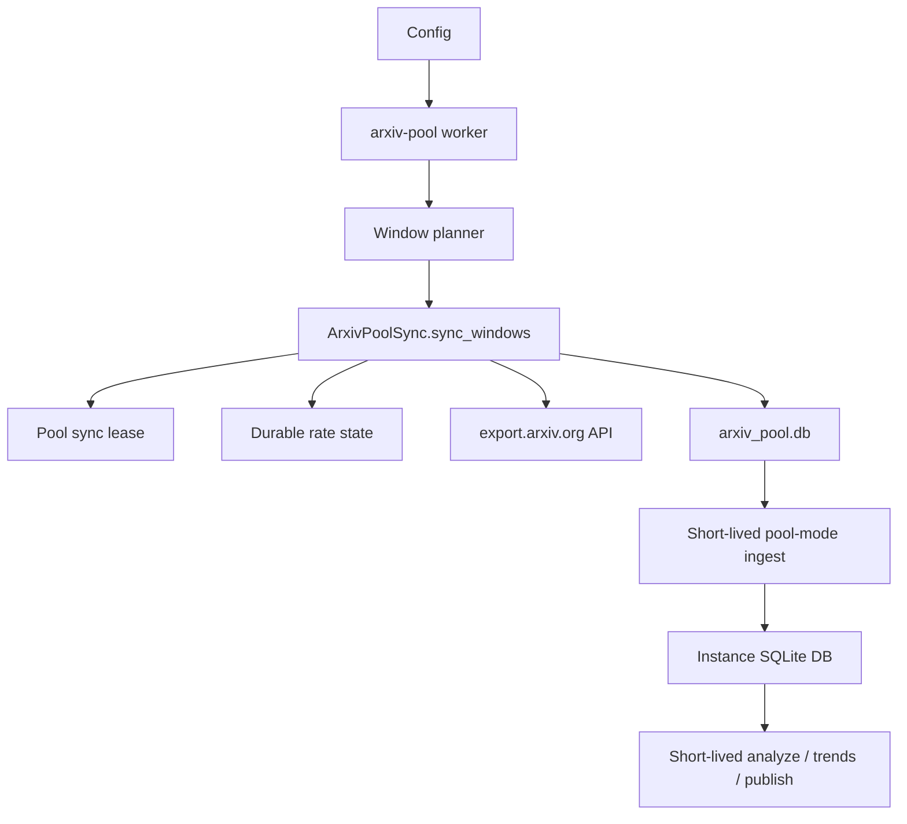

# Long-Running arXiv Pool Worker Proposal

Status: Accepted and implemented

Date: 2026-05-14

Related notes:

- `docs/design/arxiv-paper-pool.md`
- `docs/design/arxiv-429-access-strategy.md`
- `docs/design/long-running-operations.md`

## Summary

Add a foreground long-running arXiv pool worker that continuously maintains the
shared arXiv metadata pool introduced by `docs/design/arxiv-paper-pool.md`.

The worker is responsible for planning and syncing query windows into the pool
database. Short-lived Recoleta ingest, analysis, and publishing commands remain
separate from the worker lifecycle. When an instance uses
`SOURCES.arxiv.mode=pool`, its ingest reads cached paper drafts from the pool and
does not require the worker process to be alive at that moment.

The first version should be a portable foreground command. Operating-system
service integration belongs in deployment documentation, not in the pool core.

## Background

The arXiv paper pool MVP moved upstream arXiv API access behind a shared SQLite
cache with durable rate state, cooldown state, query-window records, and a
pool-local sync lease. It added one-shot commands:

- `recoleta arxiv-pool sync`
- `recoleta arxiv-pool backfill`
- `recoleta inspect arxiv-pool freshness`
- `recoleta admin arxiv-pool gc`

Those commands are enough for manual syncs, CI-style workflows, and external
schedulers. They are not a complete answer for a pool that should stay alive for
hours or days, tolerate long network outages, and recover automatically without
coupling the pool lifecycle to Recoleta analysis runs.

## Problem

Today, users who want a continuously maintained pool must wrap one-shot sync and
backfill commands in an external loop. That leaves several behaviors outside the
application boundary:

- how often to plan fresh query windows
- how to retry after transient network failures
- how to sleep while arXiv cooldown is active
- how to expose the worker's last heartbeat and last error
- how to keep the sync lease scoped only to active upstream work

The result is operationally possible but not first-class. A long-running worker
should provide the control loop while reusing the existing pool storage and sync
primitives.

## Goals

- Maintain a shared arXiv pool independently from short-lived instance ingest,
  analysis, trend generation, and publishing commands.
- Keep all upstream arXiv API access behind the pool's durable limiter and sync
  lease.
- Continue serving cached data to pool-mode ingest while the worker is stopped,
  sleeping, rate-limited, or unable to reach the network.
- Recover from transient failures and long network outages without deleting or
  invalidating completed cache windows.
- Make worker state machine-readable through JSON output and
  `inspect arxiv-pool freshness`.
- Keep the core implementation portable across macOS, Linux, Windows, and
  container runtimes.

## Non-goals

- Do not add OS-specific service installation to core Recoleta commands.
- Do not require a live worker for pool-mode ingest to read already cached
  windows.
- Do not make instance databases share `items`, `contents`, analyses, trends, or
  publish outputs.
- Do not bypass arXiv API rate limits with concurrent clients, proxies, browser
  automation, or fake request identities.
- Do not cache PDFs, source archives, or full text in this feature.
- Do not replace one-shot `sync` and `backfill`; they remain useful for manual
  repair and controlled backfills.

## User-facing Behavior

Add a foreground worker command:

```bash
recoleta arxiv-pool worker --config config.yaml
```

Initial options:

```bash
--poll-interval-seconds 300
--lookback-days 3
--idle-jitter-seconds 30
--json
```

Optional backfill options:

```bash
--backfill-start YYYY-MM-DD
--backfill-end YYYY-MM-DD
```

The command should run until interrupted. Users can supervise it with
`launchd`, `systemd`, Docker, `tmux`, `nohup`, or another process manager.

The command should not daemonize itself. Foreground execution keeps logging,
signals, and supervision behavior predictable across environments.

## Architecture

The worker is a thin control loop around the existing pool components:



Worker loop:

1. Load settings and resolve `ARXIV_POOL.db_path`.
2. Build current-day and lookback query windows from configured arXiv queries.
3. Optionally add historical backfill windows.
4. Call `ArxivPoolSync.sync_windows(...)`.
5. Persist worker heartbeat and outcome.
6. Decide the next wake time from cooldown, failures, backfill progress, and
   poll interval.
7. Sleep without holding the sync lease.
8. Exit gracefully on `SIGINT` or `SIGTERM`.

The worker should never hold the sync lease while idle. The lease protects
active upstream work only.

## Lifecycle Separation

The desired operating model is:

```text
Long-running arXiv pool worker
  -> writes shared arxiv_pool.db

Short-lived recoleta ingest command
  -> reads cached pool windows
  -> writes instance-local items

Short-lived recoleta analyze/trends/publish commands
  -> read instance-local DB
  -> do not depend on a live pool worker
```

Analysis does not read the pool directly in this proposal. The pool remains an
upstream metadata cache for ingest. Instance-local storage continues to define
the analysis and publishing surface.

## Failure Semantics

On HTTP 429:

- Persist `cooldown_until` in the existing rate state.
- Record the current window as `rate_limited`.
- Stop upstream work for the current pass.
- Sleep until cooldown expires, with optional jitter.
- Keep completed windows readable by pool-mode ingest.

On network outage or transient upstream failure:

- Record the failed window with `error_category` and `error_message`.
- Keep completed windows readable.
- Retry later with bounded backoff.
- Do not hold the sync lease while waiting for retry.
- Do not advance ingest watermarks for unavailable windows.

On process crash:

- Release the lease on normal shutdown when possible.
- Rely on the existing lease expiry behavior after hard crashes.
- Resume from persisted window status on restart.

On cache miss during ingest:

- Return the existing structured `pool_window_unavailable_total` diagnostic.
- Do not fall back to direct arXiv calls unless an explicit separate mode is
  introduced later.

## Persistence

The first implementation can reuse existing window and rate state tables for
sync correctness. Add a small worker state table for operational visibility:

### `arxiv_pool_worker_state`

- `name`: primary key, for example `default`
- `last_started_at`
- `last_heartbeat_at`
- `last_completed_at`
- `last_planned_windows_total`
- `last_completed_windows_total`
- `last_cache_hit_total`
- `last_failed_windows_total`
- `last_cooldown_until`
- `next_wake_at`
- `last_error_category`
- `last_error_message`

Future retry tuning may add per-window scheduling fields:

- `attempt_count`
- `last_attempt_at`
- `next_attempt_at`

Those fields are not required for the first version if bounded backoff is kept
in the worker loop and failed windows are retried on later passes.

## Observability

The worker should emit machine-readable lifecycle events:

- worker start
- worker stop
- heartbeat
- planned windows
- sync pass result
- cooldown active
- transient failure
- next wake time

`--json` should print JSON lines or structured JSON payloads suitable for
supervisor logs.

`recoleta inspect arxiv-pool freshness` should include worker state when the
state table exists:

- last heartbeat
- last completed pass
- last error
- next wake time
- active cooldown
- recent window status summary

## OS Integration Strategy

Recoleta should provide only a portable foreground worker command in core code.
Operating system integration should be documented as examples:

- macOS: `launchd`
- Linux: `systemd`
- Windows: Task Scheduler or a service wrapper
- Docker: container entrypoint with restart policy
- Manual local runs: `tmux` or `nohup`

This keeps platform-specific process supervision, log routing, restart policy,
and user permissions out of the core pool implementation.

Implementation details that should remain portable:

- Use `pathlib.Path` for file paths.
- Avoid Unix-only daemonization behavior.
- Handle `KeyboardInterrupt` and best-effort `SIGTERM` shutdown.
- Write logs to stdout/stderr and let the supervisor collect them.
- Store durable state in SQLite, not process memory.

### Example `launchd` plist

```xml
<?xml version="1.0" encoding="UTF-8"?>
<!DOCTYPE plist PUBLIC "-//Apple//DTD PLIST 1.0//EN"
  "http://www.apple.com/DTDs/PropertyList-1.0.dtd">
<plist version="1.0">
<dict>
  <key>Label</key>
  <string>tech.voile.recoleta.arxiv-pool-worker</string>
  <key>ProgramArguments</key>
  <array>
    <string>/usr/local/bin/uv</string>
    <string>run</string>
    <string>recoleta</string>
    <string>arxiv-pool</string>
    <string>worker</string>
    <string>--config</string>
    <string>/Users/example/recoleta/config.yaml</string>
    <string>--json</string>
  </array>
  <key>WorkingDirectory</key>
  <string>/Users/example/recoleta</string>
  <key>RunAtLoad</key>
  <true/>
  <key>KeepAlive</key>
  <true/>
</dict>
</plist>
```

### Example `systemd` unit

```ini
[Unit]
Description=Recoleta arXiv pool worker
After=network-online.target
Wants=network-online.target

[Service]
Type=simple
WorkingDirectory=/srv/recoleta
ExecStart=/usr/local/bin/uv run recoleta arxiv-pool worker --config /srv/recoleta/config.yaml --json
Restart=on-failure
RestartSec=30

[Install]
WantedBy=multi-user.target
```

## Acceptance Criteria

- `recoleta arxiv-pool worker --config config.yaml` runs as a foreground
  long-running process.
- The worker repeatedly syncs configured current and lookback windows.
- The worker does not issue upstream requests while pool cooldown is active.
- The worker keeps completed cache windows readable during network outages.
- Killing and restarting the worker does not corrupt the pool.
- A stale sync lease does not permanently block future worker runs.
- Pool-mode ingest can read cached windows while the worker is stopped.
- `inspect arxiv-pool freshness --json` reports worker state when available.
- Tests cover planning, cooldown sleep decisions, transient failure retry,
  graceful stop, stale lease recovery, and pool-mode ingest while the worker is
  unavailable.

## Rollout Plan

1. Add `arxiv-pool worker` behind the existing opt-in pool configuration.
2. Add worker state persistence and inspect output.
3. Add focused tests for the loop and failure semantics.
4. Document macOS `launchd` and Linux `systemd` examples.
5. Validate against local fleet pool mode while keeping one-shot sync and
   backfill as supported commands.
