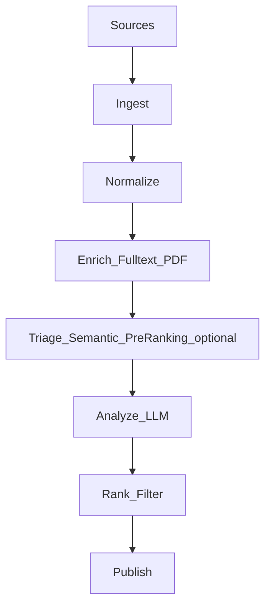

# Semantic Pre-Ranking Before Stage 4 (Analyze/LLM)

This document specifies a design to **rank and optionally filter** candidate items *before* invoking the LLM analysis, using semantic similarity to user-defined `TOPICS`. The goal is to increase the ROI of Stage 4 and reduce LLM spend when a backlog exists.

## Why this is needed

### Current behavior (no pre-ranking)

- `recoleta analyze` selects candidates purely by **state + recency** (`created_at DESC`) with a hard `limit` (default 100).
  - Source of truth: `Repository.list_items_for_analysis()` (`recoleta/storage.py`).
  - Effective query shape: `WHERE state IN (ingested, enriched, retryable_failed) ORDER BY created_at DESC LIMIT :limit`.
- Stage 4 (Analyze/LLM) runs for each selected item and computes `relevance_score` inside the LLM output, but that score only becomes useful **after** the LLM call.
  - Source of truth: `PipelineService.analyze()` (`recoleta/pipeline.py`) + `LiteLLMAnalyzer.analyze()` (`recoleta/analyzer.py`).
- Stage 5 (Rank & Filter) currently happens after analysis/persistence, and therefore cannot reduce Stage 4 calls.
  - Source of truth: `Repository.list_items_for_publish()` (`recoleta/storage.py`) + `PipelineService.publish()` (`recoleta/pipeline.py`).

This means that when the candidate pool is large, **LLM spend is currently driven by recency, not relevance to topics**.

## Goals

- **Prioritize** high-topic-relevance items so they enter Stage 4 earlier.
- **Optionally reduce** Stage 4 LLM calls via a configurable semantic threshold and/or budget.
- Keep the design:
  - compatible with the current SQLite state machine (`items.state`)
  - observable (metrics + optional debug artifacts) without high-cardinality signals
  - simple enough for v0 scale, with a clear upgrade path

## Non-goals

- Building a full vector database / long-term semantic search UI.
- Replacing Stage 5 ranking logic (this is a *pre* stage, not the final ranker).
- Storing full-text embeddings for every artifact by default.

## Proposed pipeline change

Introduce an optional stage between Enrich and Analyze:

### Stage 3.5: Triage (Semantic Pre-Ranking)

Responsibilities:

- Build a candidate pool larger than the Stage 4 limit (e.g., `candidate_pool = analyze_limit * TRIAGE_CANDIDATE_FACTOR`).
- Compute a `topic_similarity_score` for each candidate.
- Select items for Stage 4:
  - **Prioritize mode**: sort by `topic_similarity_score` and take top `analyze_limit`.
  - **Filter mode**: keep only items with score ≥ `TRIAGE_MIN_SIMILARITY`, then take top `analyze_limit`.
- Apply an **exploration budget** to reduce blind spots (e.g., always include a small random slice of low-ranked items).
- Fail open: if triage fails (embedding provider down, quota, etc.), fall back to the current recency ordering.

### High-level dataflow

## Configuration surface

The triage stage is intentionally configurable and can be toggled without changing code paths in other stages.

Suggested settings (names are illustrative, final naming should match `recoleta/config.py` conventions):

- `TRIAGE_ENABLED` (bool, default `false`): enable semantic triage before Stage 4.
- `TRIAGE_MODE` (`prioritize|filter`, default `prioritize`):
  - `prioritize`: reorder candidates, but still analyze up to `recoleta analyze --limit`.
  - `filter`: skip low-score items this run (reduces Stage 4 calls).
- `TRIAGE_EMBEDDING_MODEL` (string, default `text-embedding-3-small`): embedding model used by `litellm.embedding()`.
- `TRIAGE_EMBEDDING_DIMENSIONS` (int, optional): only for embedding models that support custom dimensions.
- `TRIAGE_QUERY_MODE` (`joined|max_per_topic`, default `joined`):
  - `joined`: embed one query string that includes all topics.
  - `max_per_topic`: embed each topic separately and use `max(sim(topic_i, item))`.
- `TRIAGE_CANDIDATE_FACTOR` (int, default `5`): `candidate_pool = analyze_limit * factor`.
- `TRIAGE_MAX_CANDIDATES` (int, default `500`): hard cap for scored candidates per run.
- `TRIAGE_ITEM_TEXT_MAX_CHARS` (int, default `1200`): truncate `triage_text` before embedding.
- `TRIAGE_MIN_SIMILARITY` (float, default `0.0`): only used in `filter` mode.
- `TRIAGE_EXPLORATION_RATE` (float, default `0.05`): reserve a slice of Stage 4 slots for exploration.
- `TRIAGE_RECENCY_FLOOR` (int, default `5`): always include the most recent N items (independent of score).

## Scoring design

### Inputs

- **User topics**: `settings.topics` (from `TOPICS`) as a list of short strings.
- **Item text**: constructed per item from fields already available in the local index and/or enrichment outputs.

Recommended `triage_text` composition (in decreasing cost order):

1. `title` only (cheapest, no extra IO)
2. `title + short excerpt` (best default when excerpt exists locally)
3. `title + content excerpt` (higher cost if it forces enrichment/network fetch)

Guideline: keep `triage_text` bounded by a max char/token budget (e.g., 800–1500 chars) to control embedding costs and latency.

### Tiered scoring methods (effect vs cost)

#### Tier 0 (fallback): lexical similarity (no new dependencies)

Use `rapidfuzz` between `title` and the topic string(s). This is a cheap fallback when embeddings are disabled/unavailable, but it is weaker on synonyms and paraphrases.

#### Tier 1 (recommended default): embeddings + cosine similarity

Use embeddings to compute semantic similarity between user topics and item text.

- Query embedding:
  - default: embed a single joined string, e.g. `"User topics: <t1>, <t2>, ..."`
  - optional: embed each topic separately and take `max(sim(topic_i, item))` (better recall, more embedding calls)
- Item embedding:
  - embed `triage_text` as defined above
- Similarity:
  - cosine similarity on normalized vectors

Implementation dependency choice:

- Prefer **LiteLLM** embeddings via `litellm.embedding()` (already in deps). For OpenAI native embedding models, the LiteLLM docs use model names like `text-embedding-3-small`.

#### Tier 2 (optional): cross-encoder rerank on top-M

For higher precision, apply a cross-encoder reranker on the embedding top-M candidates. This is usually more expensive (either a local model stack like `sentence-transformers` cross-encoders or an extra API) and should be optional.

## Selection policy (to avoid “missing the weird but important”)

Pure topic similarity is biased toward known interests and can miss novelty. To balance:

- **Exploration rate**: reserve `TRIAGE_EXPLORATION_RATE` (e.g., 5%) of the Stage 4 slots for uniformly sampled items outside top-N.
- **Recency floor**: always include the most recent `TRIAGE_RECENCY_FLOOR` items (small number) regardless of score.
- **Diversity penalty** (optional): discourage near-duplicates using existing title dedup signals.

## Cost model and trade-offs

### What costs money/latency

- **LLM completion** calls (Stage 4) dominate cost.
- **Embedding** calls are typically much cheaper, but can still hit rate limits if poorly batched.
- **Enrichment** (HTML/PDF fetch/extract) is usually cheaper than LLM completion, but has IO latency and can fail.

### Practical knobs

- Increase relevance at same LLM budget:
  - raise `TRIAGE_CANDIDATE_FACTOR` (more candidates scored, better top-K)
  - use richer `triage_text` (title + excerpt)
- Decrease cost:
  - enable filter mode with a conservative `TRIAGE_MIN_SIMILARITY`
  - cap scoring work: `TRIAGE_MAX_CANDIDATES`, `TRIAGE_ITEM_TEXT_MAX_CHARS`
  - batch embeddings (single call with `input=[...]`)

## Observability (required)

### Metrics (SQLite `metrics` table)

Add low-cardinality metrics (no item IDs/URLs):

- `pipeline.triage.candidates_total`
- `pipeline.triage.scored_total`
- `pipeline.triage.selected_total`
- `pipeline.triage.skipped_total` (filter mode)
- `pipeline.triage.embedding_calls_total`
- `pipeline.triage.embedding_errors_total`
- `pipeline.triage.duration_ms`

### Debug artifacts (optional, scrubbed)

When `WRITE_DEBUG_ARTIFACTS=true`, write scrubbed JSON artifacts on:

- provider errors / malformed responses
- (optional) a sampled “triage summary” with the top-N scores and the selection decision

Suggested artifact kinds:

- `embedding_request`
- `embedding_response`
- `triage_summary`

## Failure handling

- **Fail open**: if triage cannot produce a ranking (provider down, quota, unexpected response), the pipeline should fall back to the existing recency ordering.
- Record the failure via:
  - `pipeline.triage.embedding_errors_total += 1`
  - an `error_context` artifact (and optionally an `embedding_request`/`embedding_response` artifact when enabled)

## Privacy considerations

Embedding providers will receive some text derived from items (at minimum titles). Users should be able to:

- disable triage entirely (`TRIAGE_ENABLED=false`)
- choose a local embedding option (optional dependency) if they do not want to send content to third parties

## Measuring effectiveness

Triage is only valuable if it improves “LLM output per dollar”. Practical evaluation approaches:

- **Online proxy metric**: compare the distribution of Stage 4 `relevance_score` before/after enabling triage (mean/p50/p90).
- **Recall guardrail**: monitor how often exploration slots produce high `relevance_score` items (indicates what the ranker would have missed).
- **Cost accounting**:
  - Stage 4: already tracked by `pipeline.analyze.llm_calls_total` and duration metrics.
  - Stage 3.5: track embedding calls/errors/duration; optionally add `pipeline.triage.estimated_cost_usd` once pricing is wired.

## Data model (optional caching)

Default v0 behavior can compute embeddings on-the-fly per run and **not persist** them to keep schema simple.

If repeated re-scoring becomes a noticeable cost (e.g., filter mode keeps large backlogs), add a small cache table that stores only scalar scores (not full vectors), keyed by item and a stable topics fingerprint.

Example logical table: `triage_scores`

- `id` (PK)
- `item_id` (FK -> `items.id`, unique with `topics_hash` + `model`)
- `topics_hash` (sha256 of normalized topics list + embedding model)
- `model` (embedding model string)
- `method` (`embedding_cosine|fuzz_title|...`)
- `item_text_hash` (sha256 of `triage_text`)
- `score` (real)
- `created_at`

This avoids storing large vectors in SQLite while allowing fast reuse when neither topics nor the item text fingerprint changed.

## Dependency selection

Default:

- Reuse `litellm` and call `litellm.embedding()` for embeddings (no new package required).

Optional alternatives:

- `sentence-transformers` for fully local embeddings (higher install/runtime footprint, often pulls in `torch`).
- Vector DBs (FAISS/Chroma/etc.) are explicitly out of scope for v0 triage.

## Implementation notes (for a future PR)

- Extend `PipelineService.analyze()` to:
  1. Fetch a larger candidate pool.
  2. Run triage scoring.
  3. Process selected items with enrich + LLM.
- Provide a `Triage` interface (similar to `Analyzer`) to enable test doubles.
- Add tests as executable specs:
  - triage enabled → low-score items do not trigger analyzer calls
  - triage failure → pipeline falls back to recency ordering
  - triage metrics are emitted
