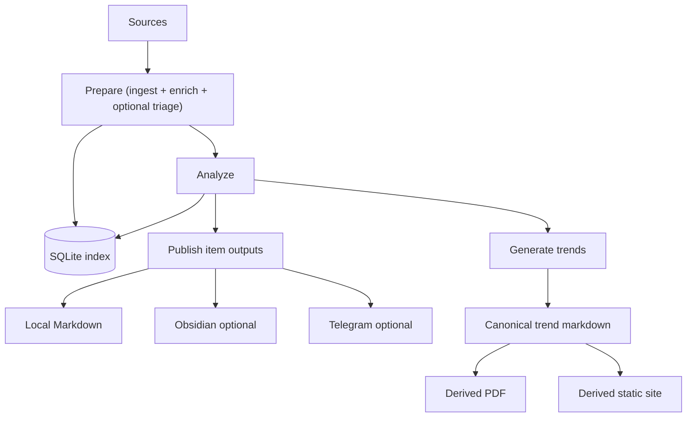

# Recoleta System Overview

Recoleta is a personal research intelligence funnel. It pulls items from multiple sources (arXiv, Hacker News, Hugging Face Daily Papers, OpenReview, newsletters via RSS), stores raw and derived state in SQLite, uses an LLM to produce high-signal summaries, and publishes the selected outputs to **local Markdown by default** (with optional Obsidian and Telegram integrations). The same canonical markdown trend notes can also be republished as browser-rendered PDFs and a static website.

## Goals

- Ingest heterogeneous sources into a **single normalized item model**.
- Run **incremental** processing (idempotent, resumable, deduplicated).
- Support both default incremental pulls and targeted UTC-day catch-up runs.
- Use LLM to produce:
  - high-signal summary
  - topic tags and a relevance score against user-defined interests
- Support one or more topic streams that share ingest state while keeping analyze and publish scopes isolated.
- Publish the best summaries to one or more user-facing targets:
  - local Markdown output (default)
  - Obsidian Vault (optional)
  - Telegram (optional, mobile digest)
  - derived trend PDF and static site surfaces from canonical markdown notes
- Persist durable state into:
  - a local **SQLite index** (dedupe, pull state, retry, trend stats)
  - user-specified filesystem paths (raw artifacts + Markdown notes)
- Make failures observable and debuggable (structured logs + debug artifacts).

## Non-goals (for v0)

- Multi-user tenancy and account management.
- Real-time streaming ingestion.
- Full-text search UI (filesystem Markdown and Obsidian are the primary UIs).
- Long-term distributed storage (single-machine is enough).

## Primary user workflow

1. Configure sources, topics or topic streams, output paths, LLM model, and publish targets.
2. Run the pipeline on a schedule, manually stage by stage, or as a targeted `--date` catch-up for one UTC day.
3. Read the local Markdown output (for example `latest.md`, `Inbox/`, and `Trends/`).
4. Optionally receive a curated Telegram batch, browse notes in an Obsidian Vault, or publish a static trends site.

## High-level dataflow

## Core invariants

- **Idempotency**: the same source item processed twice must not create duplicates or re-send Telegram messages.
- **Window correctness**: date-targeted runs must stay within the requested UTC day and must not pull newer or older items into that run.
- **Fail fast + retry**: transient IO errors are retried with backoff; schema/config errors fail fast.
- **No sensitive logging**: never log tokens, raw cookies, or personal data; mask URLs if needed.
