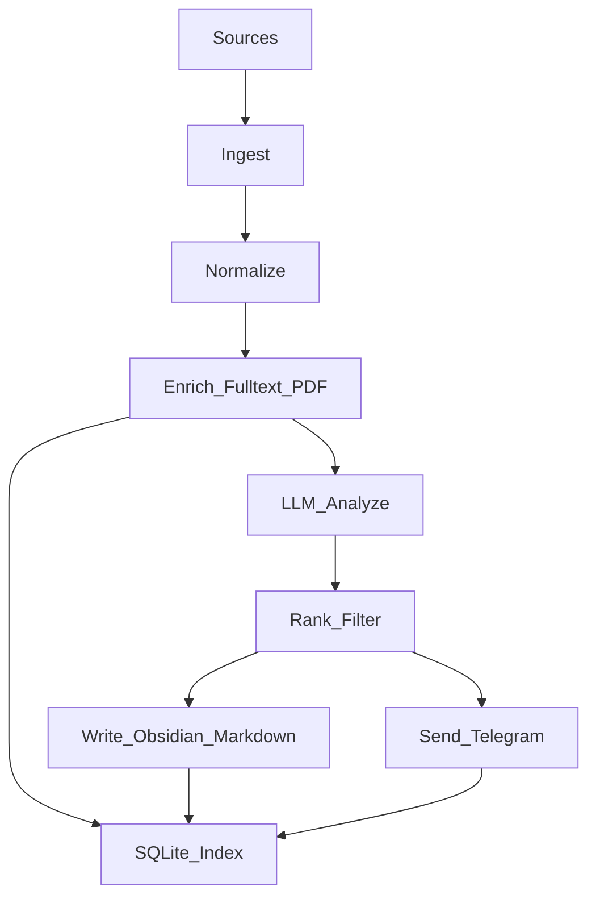

# Recoleta System Overview

Recoleta is a personal research intelligence funnel. It pulls items from multiple sources (arXiv, Hacker News, Hugging Face Daily Papers, OpenReview, newsletters via RSS), stores raw/normalized records, uses an LLM to extract trends and produce high-signal summaries/insights/idea directions, then distributes selected insights to the user via Telegram and writes all processed artifacts into an Obsidian Vault.

## Goals

- Ingest heterogeneous sources into a **single normalized item model**.
- Run **incremental** processing (idempotent, resumable, deduplicated).
- Use LLM to produce:
  - concise summary
  - short insight (why it matters)
  - idea directions (what to try next)
  - topic tags and a relevance score against user-defined interests
- Deliver the best insights to Telegram for mobile reading.
- Persist everything into:
  - a local **SQLite index** (dedupe, state, retry, trend stats)
  - user-specified filesystem paths (raw artifacts + Obsidian Markdown notes)
- Make failures observable and debuggable (structured logs + debug artifacts).

## Non-goals (for v0)

- Multi-user tenancy and account management.
- Real-time streaming ingestion.
- Full-text search UI (Obsidian is the primary UI).
- Long-term distributed storage (single-machine is enough).

## Primary user workflow

1. Configure sources, topics, output paths, LLM model, Telegram destination.
2. Run scheduled or manual pipeline.
3. Receive a small batch of curated insights on Telegram.
4. Browse/annotate notes in Obsidian Vault.

## High-level dataflow

## Core invariants

- **Idempotency**: the same source item processed twice must not create duplicates or re-send Telegram messages.
- **Fail fast + retry**: transient IO errors are retried with backoff; schema/config errors fail fast.
- **No sensitive logging**: never log tokens, raw cookies, or personal data; mask URLs if needed.

