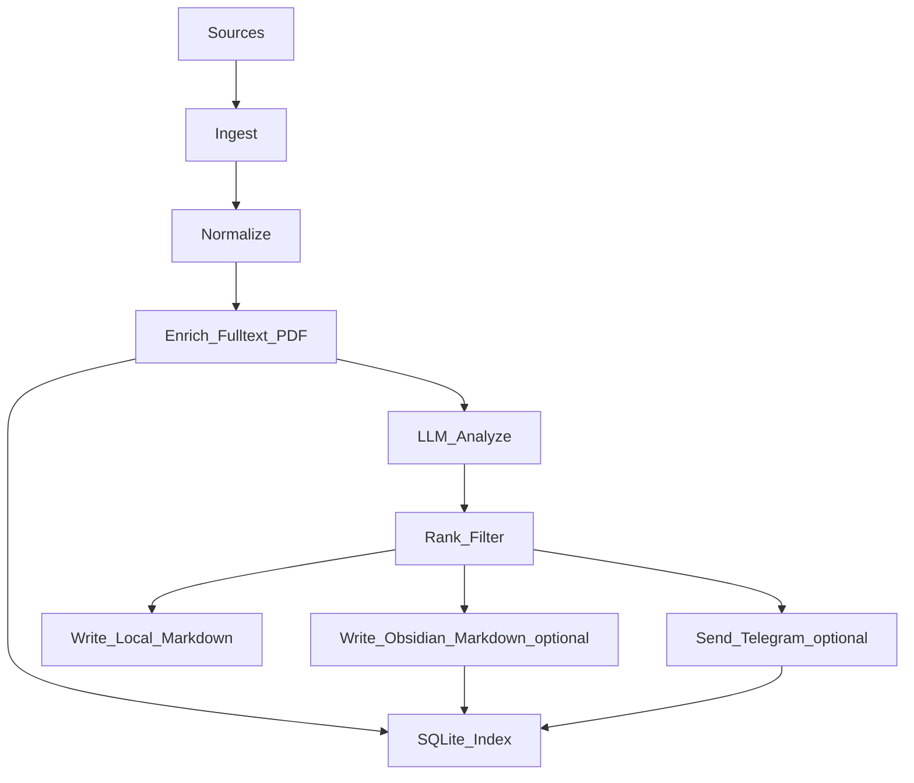

# Recoleta System Overview

Recoleta is a personal research intelligence funnel. It pulls items from multiple sources (arXiv, Hacker News, Hugging Face Daily Papers, OpenReview, newsletters via RSS), stores raw/normalized records, uses an LLM to produce high-signal summaries, then publishes the selected outputs to **local Markdown by default** (with optional Obsidian and Telegram integrations).

## Goals

- Ingest heterogeneous sources into a **single normalized item model**.
- Run **incremental** processing (idempotent, resumable, deduplicated).
- Use LLM to produce:
  - high-signal summary
  - topic tags and a relevance score against user-defined interests
- Publish the best summaries to one or more user-facing targets:
  - local Markdown output (default)
  - Obsidian Vault (optional)
  - Telegram (optional, mobile digest)
- Persist durable state into:
  - a local **SQLite index** (dedupe, state, retry, trend stats)
  - user-specified filesystem paths (raw artifacts + Markdown notes)
- Make failures observable and debuggable (structured logs + debug artifacts).

## Non-goals (for v0)

- Multi-user tenancy and account management.
- Real-time streaming ingestion.
- Full-text search UI (filesystem Markdown and Obsidian are the primary UIs).
- Long-term distributed storage (single-machine is enough).

## Primary user workflow

1. Configure sources, topics, output paths, LLM model, and publish targets.
2. Run scheduled or manual pipeline.
3. Read the local Markdown output (e.g. `latest.md` + `Inbox/`).
4. Optionally receive a small curated batch on Telegram and/or browse notes in an Obsidian Vault.

## High-level dataflow

## Core invariants

- **Idempotency**: the same source item processed twice must not create duplicates or re-send Telegram messages.
- **Fail fast + retry**: transient IO errors are retried with backoff; schema/config errors fail fast.
- **No sensitive logging**: never log tokens, raw cookies, or personal data; mask URLs if needed.

