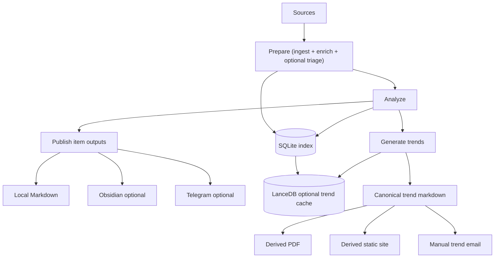

# Recoleta System Overview

Recoleta is a local-first AI research radar. It pulls items from multiple
sources (arXiv, Hacker News, Hugging Face Daily Papers, OpenReview, newsletters
via RSS), stores raw and derived state in SQLite, uses an LLM to produce
high-signal summaries, and publishes the selected outputs to **local Markdown
by default** (with optional Obsidian and Telegram delivery plus derived static
site and manual trend email surfaces). Trend generation reuses that stored
corpus, can augment prompts with retrieved overview/history packs, and
republishes canonical markdown trend notes as browser-rendered PDFs, a static
website, and manual trend email batches.

## Goals

- Ingest heterogeneous sources into a **single normalized item model**.
- Run **incremental** processing (idempotent, resumable, deduplicated).
- Support both default incremental pulls and targeted UTC-day catch-up runs.
- Use LLM to produce:
  - high-signal summary
  - topic tags and a relevance score against user-defined interests
- Let trend generation reuse stored item/trend documents plus a local LanceDB vector cache for retrieval-heavy prompts.
- Support one instance per workspace, with fleet manifests aggregating several child instances when you want a combined deployment.
- Publish the best summaries to one or more user-facing targets:
  - local Markdown output (default)
  - Obsidian Vault (optional)
  - Telegram (optional, mobile digest)
  - derived trend PDF and static site surfaces from canonical markdown notes
  - manual trend email preview/send from canonical trend markdown plus sibling
    presentation sidecars and site link-map artifacts
- Persist durable state into:
  - a local **SQLite index** (dedupe, pull state, retry, trend stats)
  - user-specified filesystem paths (raw artifacts + Markdown notes)
- Make failures observable and debuggable (structured logs + debug artifacts).

## Non-goals (for v0)

- Multi-user tenancy and account management.
- Real-time streaming ingestion.
- Full-text search UI (filesystem Markdown and Obsidian are the primary UIs).
- Long-term distributed storage (single-machine is enough).

## Primary user workflow

1. Configure sources, topics, output paths, LLM model, and publish targets.
   Add `email:` settings separately if you want manual trend email preview/send.
2. Run the pipeline on a schedule, manually stage by stage, or as a targeted `--date` catch-up for one UTC day.
3. Read the local Markdown output (for example the latest publish index
   `latest.md`, `Inbox/`, and `Trends/`). Use `recoleta inspect freshness`
   when you need the operator-facing freshness snapshot instead of one publish
   surface.
4. Optionally receive a curated Telegram batch, browse notes in an Obsidian
   Vault, publish a static trends site, or send a manual trend email batch.

## High-level dataflow

## Core invariants

- **Idempotency**: the same source item processed twice must not create
  duplicates or re-send Telegram messages, and the same trend email batch must
  not be re-sent accidentally to the same configured recipients.
- **Window correctness**: date-targeted runs must stay within the requested UTC day and must not pull newer or older items into that run.
- **Fail fast + retry**: transient IO errors are retried with backoff; schema/config errors fail fast.
- **No sensitive logging**: never log tokens, raw cookies, or personal data; mask URLs if needed.
- **Repairable outputs**: canonical trend markdown, sibling presentation
  sidecars, and stored trend documents must be sufficient to rerender PDFs, the
  static site, and manual trend email artifacts without rerunning
  ingest/analyze.
