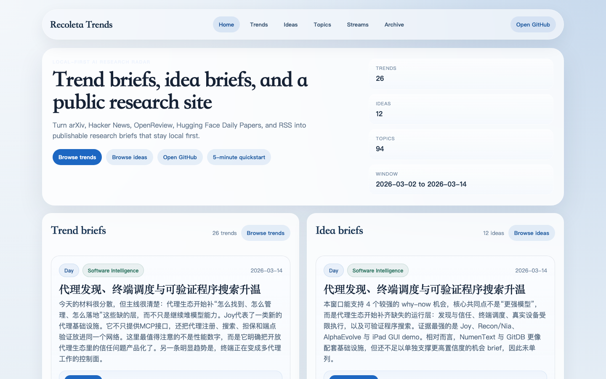
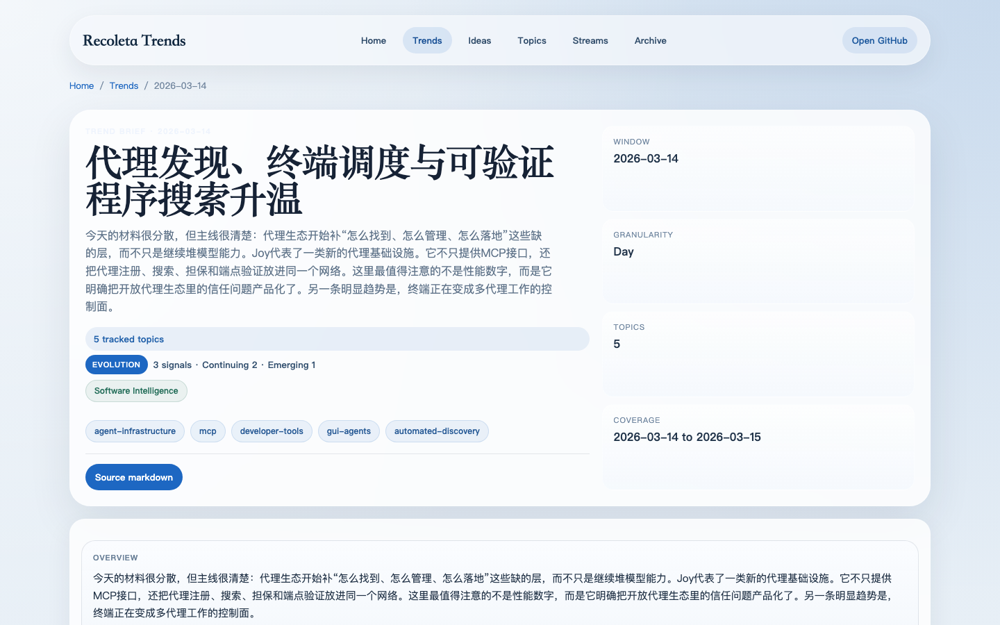
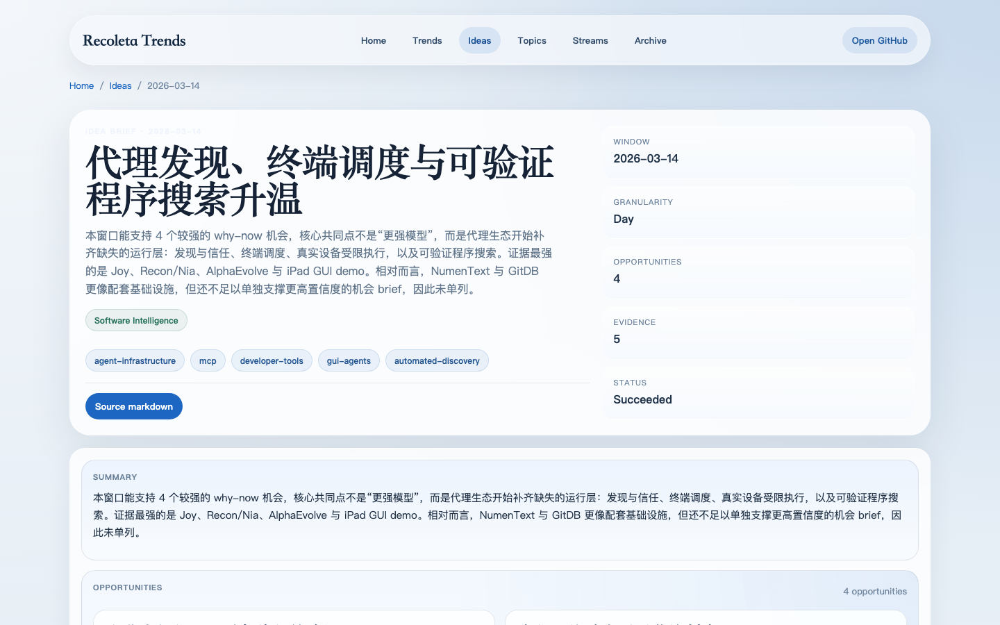

# Recoleta First Output Tour

Use this guide after your first `run now`. It tells you where to look after the
default workflow and how to rerender one surface if you need to.

## 1. Check that the first run worked

If you ran:

```bash
uv run recoleta run now
```

or:

```bash
docker compose run --rm recoleta run now
```

open these paths first:

- `MARKDOWN_OUTPUT_DIR/latest.md` or `./data/outputs/latest.md`: summary page
  for the latest run
- `MARKDOWN_OUTPUT_DIR/Inbox/`: one Markdown note per published item
- `MARKDOWN_OUTPUT_DIR/Trends/`: day-level trend briefs from the same workflow,
  plus adjacent `.presentation.json` sidecars for canonical trend notes
- `MARKDOWN_OUTPUT_DIR/site/index.html`: the rebuilt static site
- `RECOLETA_DB_PATH`: the SQLite database that later workflows build from
- `MARKDOWN_OUTPUT_DIR/Ideas/` when the day has enough evidence, plus adjacent
  `.presentation.json` sidecars for canonical idea notes
- `MARKDOWN_OUTPUT_DIR/Localized/<language>/` when `localization.targets` is
  configured. Localized trees are still markdown-only.

If you started from a preset, use the output paths in that preset YAML file.

## 2. Rerender one surface only

A normal `run now` already attempts publish, day-level trends, day-level ideas,
and site build. It also attempts translation when `localization.targets` is
configured. Use these commands only when you want to rerender one surface:

```bash
uv run recoleta stage trends --granularity day --date 2026-03-14
uv run recoleta stage ideas --granularity day --date 2026-03-14
uv run recoleta run site build
```

That updates:

- `MARKDOWN_OUTPUT_DIR/Trends/`
- `MARKDOWN_OUTPUT_DIR/Ideas/` when the selected day has enough evidence
- `MARKDOWN_OUTPUT_DIR/site/index.html` and the related trend or idea pages

For canonical trend and idea notes, the same rerender also refreshes the
adjacent `.presentation.json` sidecars in those directories.

`stage ideas` needs an existing trend synthesis output for the same window.
Low-evidence windows can still be suppressed.

## 3. Compare your output with the public examples

### Site home

Local path:

- `MARKDOWN_OUTPUT_DIR/site/index.html`

Public example:

- <https://neapolitanicecream.github.io/recoleta/>



### Trend brief

If `run now` already created a day brief, open it. To rerender a specific day:

```bash
uv run recoleta stage trends --granularity day --date 2026-03-14
```

Local paths:

- `MARKDOWN_OUTPUT_DIR/Trends/*.md`
- `MARKDOWN_OUTPUT_DIR/Trends/*.presentation.json`
- `MARKDOWN_OUTPUT_DIR/site/trends/*.html`

Public examples:

- <https://neapolitanicecream.github.io/recoleta/en/trends/index.html>
- <https://neapolitanicecream.github.io/recoleta/en/streams/software-intelligence.html>



### Idea brief

If the workflow created ideas for that day, open them. To rerender a specific
day:

```bash
uv run recoleta stage ideas --granularity day --date 2026-03-14
```

Local paths:

- `MARKDOWN_OUTPUT_DIR/Ideas/*.md`
- `MARKDOWN_OUTPUT_DIR/Ideas/*.presentation.json`
- `MARKDOWN_OUTPUT_DIR/site/ideas/*.html`

Public examples:

- <https://neapolitanicecream.github.io/recoleta/en/ideas/index.html>
- <https://neapolitanicecream.github.io/recoleta/en/streams/software-intelligence.html>



## 4. Pick the closest preset example

### Agents radar

- Start from: [`presets/agents-radar.yaml`](../../presets/agents-radar.yaml)
- Closest public example:
  <https://neapolitanicecream.github.io/recoleta/en/streams/software-intelligence.html>
- Expect: `latest.md`, `Inbox/`, trend briefs, idea briefs when evidence is
  strong enough, and the static site

### Robotics radar

- Start from: [`presets/robotics-radar.yaml`](../../presets/robotics-radar.yaml)
- Closest public example:
  <https://neapolitanicecream.github.io/recoleta/en/streams/embodied-ai.html>
- Expect the same output structure, but with robotics-heavy source material

### arXiv digest

- Start from: [`presets/arxiv-digest.yaml`](../../presets/arxiv-digest.yaml)
- Closest public example: <https://neapolitanicecream.github.io/recoleta/en/trends/index.html>
- Expect the same output structure, but from a paper-only corpus
